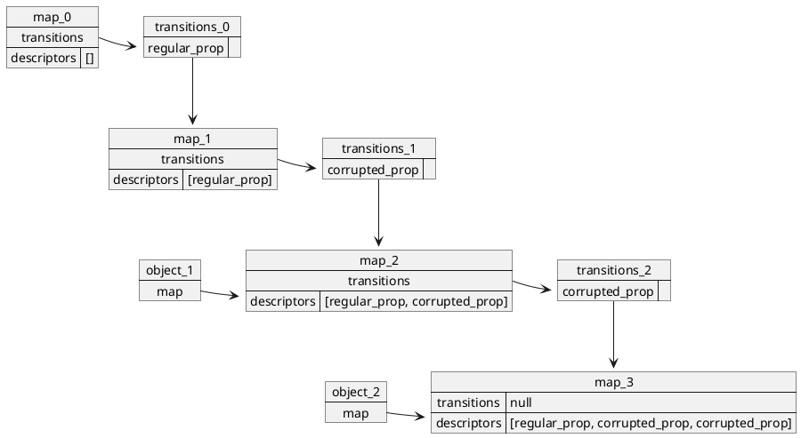
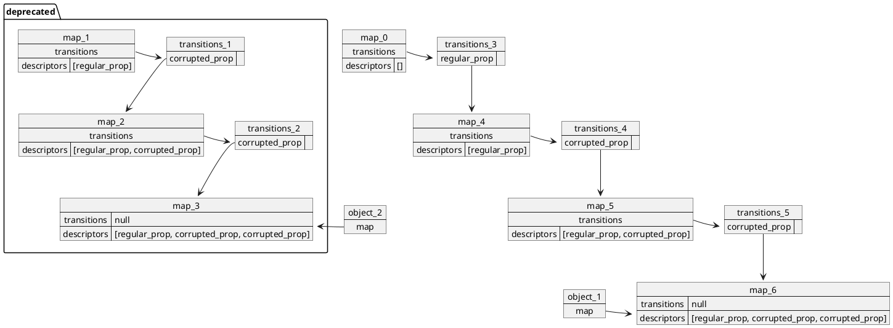
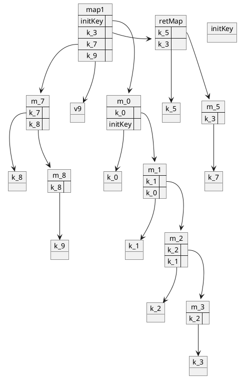
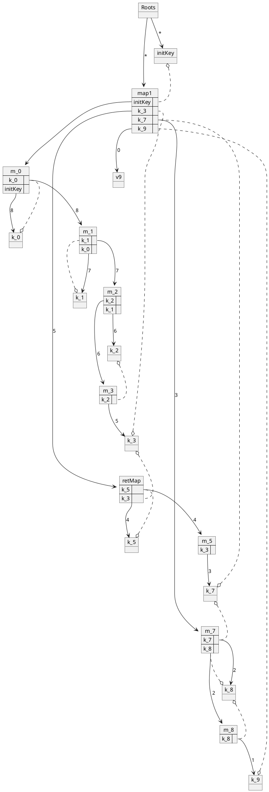

# PlantUML 源码备份

本文用来备份博客中出现的 PlantUML 图的源码。

## CVE-2021-30551






## CVE-2021-37975

```plantuml-svg
object k_0
object k_1
object k_2
object k_3

map retMap {
}

map m_3 {
k_2 =>
}

map m_2 {
k_2 =>
k_1 =>
}

map m_1 {
k_1 =>
k_0 =>
}

map m_0 {
k_0 =>
initKey =>
}

map map1 {
initKey =>
k_3 =>
}

object initKey

map1::k_3 => retMap
map1::initKey ==> m_0
m_0::k_0 ==> m_1
m_1::k_1 ==> m_2
m_2::k_2 ==> m_3

m_0::initKey ==> k_0
m_1::k_0 ==> k_1
m_2::k_1 ==> k_2
m_3::k_2 ==> k_3
```



