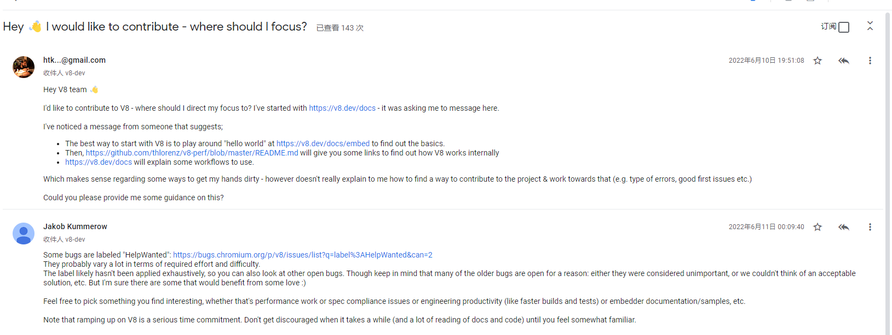

## V8 资料汇总

v8 的资料虽然很多，但是很多是非官方的资料，或者没有一个统一的所搜入口，今天在 v8-dev 用户组发现一个不错的帖子，里面包含一些我以前没搜到过的资料，我就想我干脆自己整理一份，把我觉得非常值得读的资料都列到一篇文章里，以后不断更新。

### 12.12.11 更新

From: https://groups.google.com/g/v8-dev/c/J-lbjGeu6Yw

- The best way to start with V8 is to play around "hello world" at [https://v8.dev/docs/embed](https://v8.dev/docs/embed) to find out the basics.   -- 这篇是 v8 团队发的官方文章，大体上是讲怎么把 v8 当作嵌入式解释器使用，中间讲了很多 v8 的基本概念，入门必读。
-  Then, [https://github.com/thlorenz/v8-perf/blob/master/README.md](https://github.com/thlorenz/v8-perf/blob/master/README.md) will give you some links to find out how V8 works internally  - 包含介绍 v8 内部实现的很多内容，包括很多 v8 团队发布很多 talk 的视频和文档，我今天刚知道这个，还没仔细看
-   [https://v8.dev/docs](https://v8.dev/docs) will explain some workflows to use. - 官方文档，也包括了 v8 个方面的内容，和第二个有一些内容是重复的，例如想了解 turbofan 可以看 https://v8.dev/docs/turbofan ，个人感觉第二个的导航做的更好一些。
